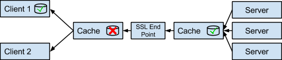

# Pragmatic Recommendations for API Design

* [REST Background](#rest-background)
* [REST API Maturity Levels (Richardson Maturity Model)](#rest-maturity)
* [Resources](#resources)
	<ul><li>[Resource Achetypes](#resource-archetypes)</li>
		<li>[Enterprise Resource Types](#enterprise-resource-types)</li>
		<li>[URI Structure](#uri-structure)</li>
		<li>[Filtering, Sorting and Paging](#filtering-sorting-paging)</li>
		<li>[To-Dos](#to-dos)</li>
	</ul>
* [HTTP Methods](#http-methods)
	<ul><li>[Method Classifications](#method-classifications)</li>
		<li>[RESTful use of Methods](#restful-use-of-methods)
			<ul>
				<li>[DELETE](#delete)</li>
				<li>[GET](#get)</li>
				<li>[OPTIONS](#options)</li>
				<li>[PATCH](#patch)</li>
				<li>[POST](#post)</li>
				<li>[PUT](#put)</li>
				<li>[The Content Location Response Pattern](#the-content-location-response-pattern)</li>
	</ul>
		</li>
		<li>[Example Interactions](#example-interactions)</li>
	</ul>
* [HTTP Status Codes](#http-status-codes)
* [HTTP Headers](#http-headers)
	<ul><li>[Entity Headers](#entity-headers)</li>
		<li>[Request Headers](#request-headers)
			<ul>
				<li>[Cache-Control Request Header](#cache-control-request-header)</li>
				<li>[Conditional Request Headers](#conditional-request-headers)</li>
				<li>[Content Negotiation Headers](#content-negotiation-headers)</li>
			</ul>
		</li>
		<li>[Response Headers](#response-headers)
			<ul>
				<li>[Using ETags](#using-etags)</li>
			</ul>
		</li>
	</ul>
* [Hypermedia](#hypermedia)
	<ul><li>[Representation Recommendation](#representation-recommendation)</li>
		<li>[Relation Types](#relation-types)</li>
		<li>[CURIs and Namespaces](#curis-and-namespaces)</li>
		<li>[The OPTIONS Response format](#the-options-response-format)
			<ul>
				<li>[The OPTIONS Media Type](#the-options-media-type)</li>
				<li>[Example 1 - A Collection Resource](#example-1-a-collection-resource)</li>
				<li>[Example 2 - A Document Resource](#example-2-a-document-resource)</li>
				<li>[Example 3 - Collection Resources and Multi-type Item Creation](#example-3-collection-resources-and-multi-type-item-creation)</li>
			</ul>
		</li>
		<li>[HATEOAS and Documentation](#hateoas-and-documentation)</li>
	</ul>
* [Caching](#caching)
* [API Versioning](#api-versioning)
* [REST API Security](#rest-api-security)
* [Do's and Don'ts](#dos-and-donts)
* [Samples and Recommendations](#samples-and-recommendations)

## Introduction

This documentation is intended as a guide for designing a robust REST API.

In order maximize usefullness, a well designed API must meet certain objectives:
* It must be lightweight (i.e. minimal external dependencies, configuration, and setup)
* It must _require_ no special tooling (even if tooling to facilitate its use is available)
* It must use loose integration contracts (i.e. promote loose coupling)
* It should be self-documenting and discoverable, assuming little or no pre-existing knowledge by API consumers
* It should be versionable in order to handle changes to underlying business objects (resources)

Taken together, these factors maximize both robustness and ease of use.


Although this will be useful to programmers, it is not a programmer's guide and will not recommend specific implementation frameworks. The practicalities related to implementing and running the resultant design are also not part of this document, but will be covered elsewhere.

## HTTP/2

While REST is described apart from any specific implementation, it is undeniable that HTTP both influenced that description and remains the only fully RESTful protocol. And now there is a new standard in the HTTP world - HTTP/2.

The idea of a "version 2" is, however, a bit of a misnomer. The specification isn't _actually_ a new version of HTTP as a whole, it is "simply" a new line protocol that can significantly improve the performance and security of HTTP interactions between client and server.

Nevertheless, in order to coherently specify this new line protocol, the HTTP 1.1 specification, embodied mainly in RFC 2616, had to be revised to provide a cleaner separation of the line protocol from the application protocol.

As part of this revision, the authors took the opportunity to update, clarify and "tweak" the specification of HTTP 1.1 application features and, in particular, to address some of the uncertainties related to using HTTP in RESTful applications.

Consequently, where this document references HTTP, it is (unless otherwise stated) referring to the [new RFCs that describe HTTP 1.1](http://httpwg.org/specs/) and not to the (now deprecated) RFC 2616 description.

# <a href="#rest-background" id="rest-background"></a>REST Background
What is REST?
REpresentational State Transfer (abbreviated as REST) is a simple way to organize interactions between independent systems.

Highlights:

* Everything is Represented as a Resource
* Resources have State
* State is Transferred over the wire (HTTP)

The design rationale for REST is based on the fact that the web is a massively scalable distributed software system that works effectively and reliably. We should therefore be able leverage the success of its underlying architecture to build integrated systems more easily.

In the [words of Roy Fielding - he who first expressed the concept - (and with a touch of hyperbole)](http://www.slideshare.net/evolve_conference/201308-fielding-evolve/34):

_A REST API is just a website for users with a limited interaction vocabulary (machine-to-machine)_

Due to the relative simplicity of interacting with REST services, REST makes an excellent candidate architecture for a product API.

## REST Architecture

REST interactions are usually referred to as an "Architectural Style". This is best understood by first establishing what it is not:

REST is not a Standard such as HTML, CSS, XML or WSDL. The W3C will not ratify REST

REST is not a Protocol such as HTTP or SOAP (although it does get a specific mention in the [updated HTTP 1.1 Specifications created as part of the HTTP/2 standardization process](http://httpwg.org/specs/).

## REST Constraints

REST was inspired by the simplicity and robustness of the Web itself and was first described by Roy Fielding in his PhD dissertation. It was designed as a set of six Constraints on top of HTTP which are detailed below.

### Client-Server

The principle of Separation of Concerns encourages us to isolate the user interface from data storage and business processing concerns.

The result is:

* Improved portability of user interfaces across OS and device platforms
* Improved scalability by simplifying server components
* Client and Server components evolve independently

### Statelessness

Following on from the client-server constraint is the assertion that communication must be stateless. The server should not be relied upon to maintain _application_ state (as opposed to _resource_ state) by storing session objects for example. Each request from client to server must contain all of the information necessary to understand the request, and cannot take advantage of any stored application context on the server. Session state is therefore maintained entirely by the client.

Note that imposing statelessness is a tradeoff in which simplicity and scalability may come at the expense of increase in network traffic since the server "forgets" application state between requests.  (More accurately, it never remembers.) This tradeoff is normally addressed by adjusting the granularity of the exchanges between client and server to reduce frequency of interactions (a.k.a "chattiness"). In general, REST is most efficient for larger-grained resources, and by exploiting...

### Caching

As with the web, the state of HTTP-accessible resources can be saved in a client-side cache so we don't have to hit the server each time the resource representation is required. The Cache constraint requires that resources be identified as cacheable if appropriate. If a response to a request is cacheable, then a client can choose to cache and reuse that response for subsequent requests for a configurable period of time.

### Uniform Interface

The Uniform Interface constraint ensures that an API looks and behaves consistently across requests and time, thus allowing each part of the API to evolve independently. It also means that interactions with _all_ APIs that are truly RESTful should behave in a broadly similar manner.

The four parts of the interface that must remain uniform are:

#### Resource Identification

Resources are uniquely identifiable using URIs such as:

    http://api.csc.com/user/ecartman


#### Resource Representation

A _representation_ of the state of a resource is produced by the server as a response when it is requested using its resource identifier.

For example, the following request

    GET http://api.csc.com/employee/ecartman

may return the following state representation:

    {
    "empid": "123456"
    "name": "Eric Cartman",
    "role": "Deputy Sheriff"
    }

#### Self-Descriptive Messages

Each client request and server response is a standard HTTP message consisting of headers and an optional body. The body+headers should contain all the information necessary to complete the requested task on both ends of the exchange. For example, response messages should explicitly indicate their cacheability.

This type of message exchange is also referred to as stateless and context-free.

#### <a href="#hateoas" id="hateoas"></a>Hypermedia as the engine of application state (a.k.a. HATEOAS)

Clients make state transitions only through actions that are dynamically identified by the server within the current state of the application (e.g., by hyperlinks within a resource representation). Except for simple fixed entry points to the application, an ideal client does not assume that any particular action is available for any particular resource beyond those described in representations previously received from the server.

### Layered System

The Layered System constraint dictates that a client need have no knowledge of whether it is connected directly to the end server, or to an intermediary or proxy on the way to the server. Use of intermediary servers may improve system scalability by enabling load-balancing and by providing shared caches. intermediary servers may also enforce security policies.

### Code on Demand (Optional)

The Code on Demand constraint allows servers to extend the behavior of a client by sending code to be executed on the client. This code usually takes the form of javascript. This is frequently seen on web pages, but the very same capability can optionally be used in a REST API.

# <a href="#rest-maturity" id="rest-maturity"></a>REST API Maturity Levels (Richardson Maturity Model)
It is common while designing REST APIs to get drawn into academic discussions about what is "truly" REST. You may find that as soon as you share a document or code describing or implementing your API, someone will claim that it is not "really" REST.

A constructive and pragmatic way of approaching this is to refer to the REST Maturity Model developed by Leonard Richardson. This model describes four levels of maturity for REST API implementation.  (See:  https://www.crummy.com/writing/speaking/2008-QCon/act3.html )

Note that in this section, and all following sections, we refer to GET, POST, and PUT et al as HTTP methods because that is the term used by the HTTP specifications and the [IANA HTTP Method Registry](http://www.iana.org/assignments/http-methods/http-methods.xhtml). However these concepts are often also referred to as HTTP verbs in other non-normative contexts.

## <a href="#level-0" id="level-0"></a>Level 0

Use HTTP to tunnel RPC calls - usually by POSTing plain old XML ("POX") to a single URI endpoint.

At Level 0 of the model, HTTP is used for transporting data from client to server without taking advantage of the web's features and capabilities. Requests and responses are usually tunnelled through a special protocol without considering application state. This usually involves the use of a single entry point, such as:

	http://ws.csc.com/blackhole

and the POST method.

SOAP and XML-RPC are considered to be REST level 0 APIs.

## <a href="#level-1" id="level-1"></a>Level 1

Use meaningfully named Resources.

A problem with SOAP and XML-RPC is that remote resources cannot be uniquely identified without inspecting the contents of the request payload.

When an API can distinguish between different resources, it is probably at Level 1. This is done by using multiple URIs, where every URI refers to a specific resource.

We start referring to resources as:

	http://api.csc.com/employees

_or_

	http://api.csc.com/products

This level still only uses a single HTTP method (usually POST).

## <a href="#level-2" id="level-2"></a>Level 2

Use appropriate HTTP methods for different actions.

This level indicates that an API is beginning to exploit the properties of the HTTP protocol in order to deal with scalability and failures; the POST method is no longer being used for all interactions; GET is being used to request resources, and DELETE for deleting resources.

The list of methods used _should_ be as limited as possible, constrained as far as possible to those that are defined by the HTTP specifications themselves.

While not specifically mentioned, Level 2 also implies correct normative use of [HTTP status codes](#http-status-codes) as well; Use 200 OK code only for success and when the response message contains an entity.

## <a href="#level-3" id="level-3"></a>Level 3

Use Hypermedia controls to describe capabilities of Resources.

This is where REST really takes off. Level 3 indicates that the resources of the API expose URI links to other resources within the application, both other "entity" resources and "action" resources. Resource representations that include such data are known as hypermedia representations.

This is the start of using HTTP as the state machine for your application - what the original thesis describing REST calls Hypermedia as the engine of application state - HATEOAS - which basically means that by following the URIs contained in your _current_ resource (or your _context_ resource), you can make all the legal state transitions from your current state. By implication, the context resource should _not_ advertise URIs for illegal transitions from its current state - e.g. a non-deletable resource should not advertise a DELETE link (although see below for more on the difference between the semantics of the API and how the server implements those semantics).

Level 3 isn't really an arrival point, it is more a departure point. An API can be minimally at Level 3 when the application resources simply contain discoverable links to other resources. However, also making discoverable the invocation semantics of the links, and the effects of the transitions those links represent is another level of HATEOAS, and part of a process of refinement that can continue almost ad infinitum, towards a completely discoverable API which allows consumer components to be built with fewer and fewer preconceptions (or "out of band" knowledge) of the application behind the API.

# <a href="#resources" id="resources"></a>Resources

In REST each resource can be considered to have its own API- for example it is no longer a case of "the insurance API" - it is a case of "the policies collection API", then the "policy API", then the linked "coverages collection API", then the "coverage API" etc. etc.
It is helpful, at least at this level, to treat each resource in a similar fashion to an object (in fact, Roy Fielding originally referred to REST as the *HTTP Object Model*):

- A resource *encapsulates* a single concept to which we want to provide an API
- A resource has state, part of which comprises links to other resources - c.f. an OO instance containing references to other instances
- A resource's API is "discoverable" - c.f. introspection, or reflection, in OO languages
- A resource is responsible *solely* for exposing and handing its own state and API

Applying these concepts to resource API design ensures that the overall application API is as flexible, loosely coupled, and dynamic as possible.

The following sections describe in more detail design and usage considerations pertaining to resources.

- [Resource Archetypes](#resource-archetypes)
- [Enterprise Resource Types](#enterprise-resource-types)
- [URI Structure](#uri-structure)
- [Filtering, Sorting and Paging](#filtering-sorting-paging)
- [To-Dos](#to-dos)

# <a href="#resource-archetypes" id="resource-archetypes"></a>Resource Archetypes

Behind a REST API is the network of resources that the API is designed to access and interact with - the resource model.

It can be instructive to think of any system fronted by a REST API as simply a web site - a network of web pages (resources) that are logically and/or conveniently linked with each other via - well - links (URIs).

In REST literature we usually find that resources are categorized into one of four archetypes. Within CSC we have added a fifth archetype, Factory Resources, that can be applied as a secondary archetype to any resource.

## <a href="#document-resources" id="document-resources"></a>Document Resources
Document resources are the basic information encapsulation in REST; analogous to files in a directory structure, entities in a data model, or object instances - or, of course, the pages of a web site. Although none of these is a perfect analogy, they encapsulate the basic idea of an "indivisible" resource. They are the "objects" that the other resource archetypes collect or operate on. They have state, described by their data *fields* along with *links* to other resources.

Document resources may have child resources, or collections of child resources, as the application's resource model requires.

## <a href="#store-resources" id="store-resources"></a>Store Resources
Store resources are *client-managed* collections of resources. The client can specifically add a new resource to a store resource. They are passive in the sense that they do not "create" contained resource instances (c.f. Collection resources below).

An example might be a resource that represents a bookmark list. The client adds references to resources to this list, removes them when they are no longer interesting, and references them as desired.

## <a href="#collection-resources" id="collection-resources"></a>Collection Resources
Collection resources are also, as their name implies, collections of resources, but in this case they are *server* managed.

In that respect they can also be considered to be directories of sub-resources managed by the server, and, in many cases, also factories of the resources they contain.

The client never *directly* adds a resource to a collection. Instead it usually "proposes" to the collection resource that a new resource be created and inserted into the collection. The client *may* however directly address the resource after it has been created and *may* even be permitted to directly delete the resource (depending upon the business need of course).

An example here might be the collection of claims that have been made against an insurance policy.

### Considerations for modeling data collections
There are, in fact, myriad ways of modeling collections of data in resources, the three most often seen being:

1. As a list of objects within a containing representation
1. As a list of links to existing resources
1. A link to a Collection resource, itself containing a list of links to item resources

In general, these three approaches apply in the following cases:

1. When the data objects concerned do not need to separately addressable as resources *and* are related to the referencing resource by a containment relationship, then a list of data objects "embedded" in the containing resource representation should be used. The application is responsible for defining modification semantics for such a list (e.g. how to add, remove, and modify objects to/from/in the list)
1. When the data objects are pre-existing resources (and, so, most likely have an association relationship with the referencing resource) then a list of direct links to the target resources should be used. Lists of links are supported by the main hypermedia representation formats that are considered later.
1. When the data objects have a containment relationship to the referencing resource (so their lifecycle is dependent upon that of the referencing resource) but they, nonetheless, need to be separately addressable, then a Collection resource should be used.

Undoubtedly there will be other cases not covered here, but these guidelines should help decide how to represent data collections in resource representations.

## <a href="#controller-resources" id="controller-resources"></a>Controller Resources
Controller resources are the concept used to model non-CRUD "procedural" interactions with another resource in REST - they are similar to methods in an OO environment. They are usually at the end of a URI path - they don't have child resources of their own (though see below for special consideration of "reified" operations).

They can be attached to any of the above three resource types - one may think of those attached to store resources, or, even more so, collection resources, as class methods, and those available on document resources as instance methods - but the OO analogy shouldn't be pushed too far.

## <a href="#factory-resources" id="factory-resources"></a>Factory Resources
Factory Resources create other resources. The "Factory" aspect of a resource can be considered as a "virtual class" in that it must be applied to another type of resource to make any sense. Such resources are normally also modeled as Collection Resources but can be any of the other three "non-virtual" types of resource as necessary, normally via the addition of a Controller sub-resource. The reason for this "multiple inheritance" approach is described in more detail under Operations, in the next section.

The behavior of a Factory resource is strictly constrained so that it is straightforward for a client to determine the request requirements and response expectations when interacting with such a resource.

# <a href="#enterprise-resource-types" id="enterprise-resource-types"></a> Enterprise Resource Types

When designing a RESTful API for an enterprise system, it is key to have a good model of the business resources of which the target system is composed. Broadly, we consider two main types of enterprise resources as requiring exposure through a REST API: Entities and Operations.


## Entities
Entities represent "what is in the portfolio" over a period of time. For Insurance, one can name contracts, coverages, risk insureds and other parties.

Entities typically have identity and lifetime/lifecycle.

Entities have attributes, they can be created and then queried (e.g. 'retrieve all contracts created today'). They can also hold references to other entities to which they are related, and can be organized in hierarchical relationships.

So it is fairly straightforward to see that entities map very cleanly to [Document resources](#document-resources).

## Operations
Operations represent "what actions can be, *or have been*, taken" against their *associated* Entities. For an insurance contract, for example, these could include surrender, issuePremium, validateClaimFolder,...

With this initial view of operations, they could seem to fit naturally into the [Controller resource archetype](#controller-resources).

However, in many ways, many (even most) operations can be considered very much *like* Entities:

- they have attributes (e.g. their execution arguments)
- they can be created and then queried:

retrieve all validateClaimFolder where user == "SMITH"

- they can be updated/deleted (consider the gradual population of the arguments of an operation over a period of time)
- they are ALSO persistent - their state can be retrieved at any time after creation
- and they have identity

By taking *this* more sophisticated view of operations, we are *reifying* the implicit "action" model of operations, and making them "first class resources" in their own right.

And if this view of operations is modeled, then they become [Document resources](#document-resources), organized as child resources of the entity resource to which they apply.

The difference between Entities and Operations is that Operations can be *executed* to update their associated Entity. In this way they are analogous to methods available on the "object" encapsulated by their associated entity, in the same way that controller resources can be so-considered.

Note, however, that "execution" of an Operation modeled as a Document resource does NOT entail deletion/destruction of that resource. Although, once executed, the Operation's state will, in all likelihood, be changed to disable re-execution (at least until after an "undo"-type action has been performed), that state is query-able into the future, a feature that can be exploited for logging, audit, undo/redo... purposes!

To model the *executable* aspect of operations, our reified Operation resources themselves have assigned actions that can be performed on the Operation resource, such as execute, undo, redo etc.

*These* actions are modeled as [Controller resources](#controller-resources) organized as child resources of the Operation resource to which they apply.

An analogy from the Java world that might help clarify this approach is the ability to introspect an application instance and obtain a java.lang.reflect.Method instance that reifies the otherwise implicit concept of a method defined on the application instance’s class. One can execute methods on that Method instance, including calling its invoke method to actually run the target method.

There are a number of reasons for modeling Operations in this way:

- Operations need to be logged and a history of operations executed on an Entity is certainly an audit requirement as well as a customer service requirement
- Operations MAY be reversible
- The arguments required for an Operation can be numerous, where it may be more convenient to build up the argument list of an Operation iteratively.
- A client application may need to manipulate several operations at one time. It is therefore useful to ask the server for data initialization and validation before the complete argument data is "committed" and the Operation is executed.
Executing an Operation (at a fine grained level) is achieved as follows:

- Create an Operation resource (from the ones available on an Entity, filtered based on user authorization etc.),
- Populate the Operation's required attributes - i.e. the operation arguments (e.g. validation date and signature for a validateClaimFolder Operation)
- and then perform an allowable action on the Operation, represented by a Controller resource attached to the Operation resource
However, it is probably desirable to implement some protocol on the server side to aggregate these three steps in order to make operation invocations by a client appear more "action" like, and so less verbose and more intuitive.

## Entity updates with far-reaching effects
One other important point concerning Operations and Entities is the question of an Entity update that has "far reaching effects". e.g. a change of marital status could invalidate a coverage on a certain insurance policy intended for only single people.

Such changes may need to be protected from "accidental" execution, logged, audited, and may well require "undo" functionality. It may be preferable, then, for such changes to be *also* modeled as Operations available on an Entity, rather than as simple attribute updates, *even though* modeling as an Operation is more complex and, possibly, less intuitive.

In many instances, even "simple" attribute updates (say, change of a person's preferred communication channel) will probably need to be logged. In these cases we MODEL the change as a "simple attribute update" (e.g. modifying the status attribute of a communication channel resource in a resource update dialog), but IMPLEMENT it as an Operation, the state of which can be retrieved as with any other Operation. For this latter purpose, such "simple" updates can be implemented via a generic Operation, available on all applicable Entities, named update.

The important point is that the *client* side of the API - the semantics of the API as seen by client - should be a natural expression of the client's desired interactions, while the *implementation* can be whatever is necessary to assure the *business* effects of those interactions, and should not bleed into the API itself.

## Entity creation via an Operation
Usually resources are created using the Factory behavior of a Collection resource - that is a request to a Collection resource creates a new resource and stores it in the collection.

However it is often desirable to model the lifecycle of an Entity resource via its membership in different collections. For example, a quote resource may reside in a collection of quotes while it is being prepared, but then need to be "moved" to a collection of offers once it has been finalized and formally proposed to a customer. When accepted the resource may "move" again, to a collection of contracts, for example.

Without presuming a lot of information that has not yet been presented, using the Factory aspect of Collection resources, it is difficult to model this type of transition in an effective manner such that, while the resource is in one collection its "readiness" or otherwise to be transferred to the next collection in its lifecycle can be simply and clearly conveyed via its own hypermedia metadata.

For this reason, Operation resources can be [Factory resources](#factory-resources) - that is, an Operation can declare itself (via its own metadata) to be a factory for another type of resource. This brings certain constraints on the behavior of the Operation: When it is "executed" it must create a resource (or a resource network) and [return response data compatible with resource creation](#post-create). Additionally, in order to avoid confusion, an Operation should either be a factory or not - it should not be both (i.e. it should not exhibit factory behavior in certain contexts but arbitrary Operation behavior in others).

# <a href="#uri-structure" id="uri-structure"></a> URI Structure

At CSC the insurance domain has been considering the impact of applying a REST API to our insurance administration offerings.

In the REST model for Insurance a basic URI looks like this :

    /csc/insurance/{component}/{mainEntityType}/{mainEntityID}/{detailType}/{detailID}

where

- {component} can be e.g. "claim" or "party" or "policy", ...
- {mainEntityType} is a main entity type from an external data model (DM), e.g. - "claimEventFolder" or "contract" or "person"
- {detail} is the name of a complement type, e.g. "coverage" or "investmentFund" or "postalAddress", modeled as a "sub resource"

The {...ID} segments identify a specific "instance" of the preceding DM entity type.

The {detailType}/{detailID} segments can, of course, appear multiple times to describe paths to child resources of detail entities.

In addition, any path segment can instead specify the resource type "operations" which then allows the operation resources applicable to the parent resource to be accessed. Operation URIs have the form:

	<path to parent resource>/operations/{operationType}/{operationInstanceID}

Operation URIs can end with an "action" path segment, such as execute or undo.

A URI whose final path segment is {component}, {mainEntityType}, {detailType}, operations, or {operationType} represents a resource "type" and can be considered a *directory* or *collection* of individual resources of that general type. They *may* also act as "factories" for their contained resource items. Consequently, they are usually modeled as [Collection resources](#collection-resources) (especially where the *factory* aspect is evident), although where they represent collections of linked resources that are "controlled" in a different part of the resource model, they may be modelled as [Store resources](#store-resources). An example of this latter use may be a collection of distributors linked to an insurance contract.

URIs that end with {mainEntityID}, {detailID}, and {operationInstanceID} are modeled as [Document resources](#document-resources).

The "action" segment that can be applied to an operation resource maps directly to the [Controller resource archetype](#controller-resources).

Note, again, that operations are being modeled as [Document resources](#document-resources), not as, what at first sight, might appear the more natural classification of [Controller resources](#controller-resources). The reasoning behind this is described above.

Finally, for retrieval requests, the use of predefined search or extract inquiry facilities (as described [in more detail in a later section](#filtering-sorting-paging)) can be specified in the URI.

- For "collection" and "store" resources, an "inquiry" ID can be specified in the query portion of the URI in order to specify search and sort criteria to apply to the list of URIs that the retrieval will return. E.g:

		.../contracts?inquiryID=contractInquiry1234&<parameters for contractInquiry1234>&<other list citeria - e.g. paging>
- For "document" resources, an "extract" ID can be specified in the query portion of the URI in order to tailor the content of the resource representation that the retrieval will return. E.g:

		.../contracts/123/investment_funds/4545?extractID=fundExtract2345&<parameters for fundExtract2345>

A set of query parameters and syntax norms that allow a more "ad-hoc" approach to response content tailoring should be considered.

Note that, although standard naming of the various components of the URI might be desirable, it is not absolutely essential, especially in an API that conforms to [Level 3 of the Richardson Maturity model](#level-3) where URIs to functionality (such as search functionality) are discovered dynamically.

## Concerning query parameters and security
HTTP URIs can contain query parameters, as demonstrated above. This is the portion of a URI that follows the "?" character and is, essentially, a set of key/value pairs that "constrain" the base URI in the context of the current request.

Although useful for, say, passing paging or search criteria to the server (particularly on GET requests where a request entity is prohibited), query parameters should not be used to convey business data in a non-safe request (e.g. the input data for a POST request), and never be used to convey sensitive information to a server (e.g. passwords).

This is for two reasons:

1. The URL is typically not encrypted in an HTTP request, even when using HTTPS (although the transport layer specification of HTTP/2 does allow for URL encryption), and so all information included in the various parts of a URL is sent in clear text.
1. Passing "input data" to a [non-safe](#non-safe) request via query parameters potentially exposes the API and its clients to security attacks, such as [Cross Site Request Forgery](https://en.wikipedia.org/wiki/Cross-site_request_forgery).

# <a href="#filtering-sorting-paging" id="filtering-sorting-paging"></a> Filtering, Sorting and Paging


## Filtering
Filtering has two aspects to it:

* Reducing the *number* of results returned by a GET of some kind of list resource (such as a Collection resource)
* Tailoring the *content* of the representation returned from a GET of a Document resource, OR (more controversially) the attribute values included in each item returned for a list resource.

### Searches
The first aspect corresponds to searching for a particular sub-set of items from a list resource and is a vital capability to standardise. It is also a well established pattern on the web - think Google.

The query parameters segment of a URI (those that follow a ? placed at the end of the path segments of the URI) is designed specifically for this type of functionality.

Some common vocabulary for expressing search criteria will be established and documented. Additionally, the use of application-specific pre-packaged searches (such as AIA’s Inquiries capability) will be catered for, probably using a specific parameter key for the package ID in the query parameters, and passing the rest of the parameters to the identified package as the arguments for the search.

### Resource content filtering
The second aspect is a lesser-used capability, but is useful for:

* reducing the size of response data from the server,
* *adding* to that data information that might not normally be returned.

The AIA administration REST API has the following functionality that is a candidate approach for this type of filtering:

* Each resource has a default set of attributes that it will return in a representation. This may or may not be the full set of attributes that the resource holds.
* The URI query parameters may contain a special parameter named _attributes whose value is a list of attribute names:** Attribute names that begin with a - are *removed* from the set of attributes that are returned
	* Attribute names that appear normally are added to the set of attributes that are returned
	* The _none attribute removes all default attributes from the set of attributes that are returned
	* The _all attribute adds all optional attributes to the set of attributes that are returned
	* Consequently, combinations of _all/_none and other attribute names allow for a completely customizable representation to be returned.

Again, pre-packaged "views" of resources (such as AIA's Extracts capability) will also be catered for, probably using a specific parameter key in the query parameters for the package ID.

However for this aspect, it should be noted that the client may have to be aware of "out of band" information (information not available or deducible from normal interactions with the resources themselves) and, therefore, necessarily ties the client to the server. Consequently, provision of, and reliance on, this type of filtering should be done sparingly if at all.

### Filtering and request types
For *both* aspects it is essential to stress that this type of filtering applies *only* to GET requests, and that GET is the *only* method that *should* be used to perform searches or obtain resource representations.

This is because GET is the only method (outside of the special methods HEAD and OPTIONS) that is safe, idempotent, and cacheable, which means that the result of a GET of a particular URI - even one with query parameters attached to it - can be safely cached and reused (within the confines of standard cache management headers), thus freeing the HTTP protocol to do what it does best - serve resources at web scale!

## Sorting
Sorting applies to lists of resources returned when GETting a collection or store resource. Since it is closely related to filtering the result set and affects the content representation returned by the GET, the logical place to specify sort criteria is, again, in the query parameters of the URI.

The default sort order of the resource *should* be logical to the resource type of the contained items, but is technically undetermined.

Again, using the AIA administration REST API as an example, sort criteria can be specified using a special query parameter key (such as _sort) whose value is a list attribute names, in the order they should be applied, with a prefix of - if the value of a specific attribute should be used to sort "in reverse".

For performance reasons it may be necessary to enforce the constraint that, to be eligible as a sort attribute, the value of the attribute should be part of the "summary state" of the resource returned in the list (which can be customized using filtering parameters as specified above).

As with resource content filtering, sorting on the server may involve the client being aware of "out of band" information, although it may be possible to dynamically convey the legal sort fields for a resource in the associated OPTIONS interaction data , thus avoiding binding the client too closely to the server.

## Paging
Paging applies to results returned by a GET of some kind of list resource (such as a collection resource), is usually only of concern to a UI-centric client, and is a "[necessary evil when you have too many items to easily show them all on one screen](https://www.nngroup.com/articles/item-list-view-all/)".

The usual approach for standard web pages is to have a default page size of a reasonable number of items (perhaps device specific), and to allow the user to specify a different size in an application preference store of some kind. These are, however, client concerns.

The server simply needs to know *in a stateless manner* the first item to return and the number of items to return. Taking the classic example of Google search, these items are passed as query parameters, start indicating the 0-based index of the first item to return, and num the number of items to return. The defaults are 0 and 10 respectively.

This is the approach that the AIA administration REST API takes (although it uses _start and _num as the query parameter names, and the default value of _num is unbounded to cater for unconstrained requests from headless clients) and is suggested for the general approach.

Each page of items received in the response page will also contain paging links to the first, previous, next and last pages of the response set.

In large systems, where a request could potentially match millions of resources, the cost of simply counting that many resources in order to calculate a URI for the last page may very well be so great as to seriously degrade the responsiveness of the system. To circumvent this problem (again, from the AIA administration REST API) a third paging-related query parameter will be allowed, _count, the value of which is the number of items after which the server should merely indicate "there are more than this number of items" (by returning a link to the next page but not to a last page).

### Paging links
Collection and Store resource representations retrieved in a paging context will contain the URIs for the next, prev(ious), first and last pages based upon the paging-related query parameters passed in the associated GET request. The format of hypermedia links in returned resource representations is [addressed in more detail in a separate section](#hypermedia), but it should be noted here that a "rel" attribute must be part of that format, the value of which should be based upon the [ IANA Link Relation registry](http://www.iana.org/assignments/link-relations/link-relations.xhtml) and it’s associated [Web Linking RFC](https://tools.ietf.org/html/rfc5988), and that these four relationship types are part of the base registry.

URIs in links so-returned should be constructed according to the context of the current request. For example, requests for the contents of a persons resource that contains 200 items might appear as follows:

GET | Details
:--| :---
GET .../persons?_num=20<br>  (the first page) | first: .../persons?_num=20<br> next:.../persons?_start=20&_num=20<br> prev: (not present)<br> last: .../persons_start=180&_num=20
GET .../persons?_start=37&_num=20<br> (second page but new _num value) | first:.../persons?_num=30<br> next:.../persons?_start=50&_num=30<br> prev:.../persons_num=30<br> last:.../persons?_start=170&_num=30
GET .../persons?_start=20&_num=30<br> (arbitrary page start) |  first:.../persons_num=20<br>next:.../persons?_start=57&_num=20<br> prev:.../persons?_start=17&_num=20<br>last:.../persons?_start=197&_num=20|

Note the following:

* The response for the first page should not contain a prev link
* The response for the last page should not contain a next link
* The link to the first page should not contain a _start parameter
* The link to the last page should contain a _num parameter and that parameter should hold the same value as was passed in the request, not the actual number of items that will appear on the last page. This is in order to preserve the paging preferences previously set by the caller, and communicated on the current request, if the caller subsequently decides to follow that link.
* If the _count parameter is present in the request and, as a consequence, the server does not calculate the exact size of the full response set, the response should not contain a last link.

Paging links should returned as part of the [hypermedia representation body](#hypermedia) and in the response Link header.

# <a href="#to-dos" id="to-dos"></a>To-Dos

## To-Dos for Resource Identifiers
1. Use meaningful resource names
1. Pluralize resource names
1. Related resources may be expressed hierarchically in URIs
1.	ref: REST in Practice

## To-Dos for Resource representation
1. Resource can have multiple representations
1. Different representations should not result in different URIs
1. Use media types
1. JSON primarily
1. XML as secondary
1. Possibly HTML for testing

# <a href="#http-methods" id="http-methods"></a>HTTP Methods

HTTP interactions are governed by a standard but extensible set of methods that have very specific semantics. As with most things HTTP these are laid down in the various HTTP "RFCs". As of HTTP 2, they are also registered in the [IANA HTTP Method Registry](http://www.iana.org/assignments/http-methods/http-methods.xhtml).

The primary methods used in RESTful interactions are:

* [GET](#get) - obtain a representation of a resource
* HEAD - return only the HTTP headers that a GET request would return
* [PUT](#put) - store a resource under the URI to which the request is sent
* [POST](#post) - a bit complicated - see below
* [PATCH](#patch) (not an HTTP 1.1 standard method, but registered all the same) - update certain properties of a resource
* [DELETE](#delete) - delete the addressed resource (from the client's perspective)
* [OPTIONS](#options) - obtain metadata pertaining to the addressed resource (broadly)

The use of each method is described below, but the methods fall into two main groups and are endowed with two constraints that allow the HTTP protocol to be fault tolerant and highly responsive.

## <a href="#note-on-content-negotiation" id="note-on-content-negotiation"></a>Note on content negotiation

In the following sections various forms of the phrase "content negotiation" will be found.

This is a fundamental concept of HTTP which allows HTTP clients (e.g. browsers) and HTTP servers to agree on the format of the data returned by the server in response to a request.

In REST this negotiation is essential for separating the resource, represented by a format-neutral URI, from the representation that is passed between client and server, which can be any format that both support for the resource.

So, for example, a server may support returning the representation of a resource in JSON, XML, or HTML. The client can express a preference for particular formats (even providing a preference rating) in the request headers (specifically the [Accept*](#content-negotiation-headers) headers). The server will return the resource representation in the highest priority format that it supports, and specify the chosen formats in the response headers (specifically the Content* headers). If the server cannot find a format that it supports in the list, it can choose to either return a default format or to reject the request with a [406 Not Acceptable](#406-not-acceptable) status code.

*But, whatever the format of the returned representation, the URI of the base resource is the same.*

# <a href="#method-classifications" id="method-classifications"></a>Method Classifications
## 5.1. CRUD Methods

The CRUD methods (obviously) achieve the Creation, Read, Update and Deletion of resources. These methods are GET, PUT, PATCH, DELETE and sometimes POST.

GET and DELETE are obvious - they fulfil the R and D roles.

PATCH is [specified by a separate RFC](http://www.iana.org/go/rfc5789) from the rest of the methods described here. It is the method used for the "delta update" of resources, so it's role is firmly that of U.

PUT and POST are multifaceted. Both can fulfil the C and U role, depending on the circumstances.
## 5.2. Non-CRUD methods

All the rest of the methods, standard and nonstandard, are, evidently, non-CRUD ... except that POST appears in this group too. The common non-CRUD methods used in REST interactions are OPTIONS and HEAD - the former is used to discover what interactions are available on a resource, the latter is used to obtain just the HTTP headers that a GET of a resource would return, in order to discover more about the resource without actually fetching the full representation (useful if generating that representation is expensive, or if the representation is very large).
## 5.3. Idempotence

An idempotent HTTP method is one where the result of the action should be the same no matter how many times it is executed on a specific URI. These methods allow the client to retry requests when the status of a previous request isn't discernible, for example (e.g. because of loss of connection).

The idempotent methods are OPTIONS, GET, HEAD, PUT and DELETE.
## 5.4. Safety

A safe HTTP method is one that does not affect the state of the addressed resource. It MAY have server-side repercussions (e.g. logging), but the state of the addressed resource itself is not changed. The use of safe methods allows for caching mechanisms to be deployed in the client and between the client and the final server.

The safe methods are GET, HEAD, and OPTIONS.

*Note that the safety constraint on the GET method precludes using this method to tunnel modification requests through HTTP!*

## <a href="#non-safe" id="non-safe"></a>5.5. Non-idempotent, non-safe

That leaves POST and PATCH which are neither safe (they both can potentially modify the state of a resource), nor idempotent (reissuing the same request is NOT guaranteed to bring about the same outcome).

The former point simply means that after a POST or PATCH (or any other non-safe method) any cached copy of a resource representation must be invalidated.

The latter point, however, has some potentially serious consequences for the otherwise fault-tolerant nature of the HTTP protocol. There are techniques to address these issues (e.g. using conditional requests and resource version tags, known as ETags).

Interestingly, a response to a POST request is specified as response is technically described as cacheable, although a vast majority of caches do not support this functionality.

# <a href="#restful-use-of-methods" id="restful-use-of-methods"></a>RESTful use of Methods

REST is (at least partly) all about using the HTTP protocol to it's maximum effect. Thus, there are clearly defined norms concerning the use of HTTP methods to interact with resources.

REST requests are clear and unambiguous expressions of *client intent*. How the server *implements* the servicing of requests is not important as long as the interface contract is 100% respected. This is no different from any Interface-Oriented protocol, of course - it is just that the habitual use of the HTTP protocol, particularly HTTP methods, has been a history of half-respect for the norms laid down in the specifications surrounding the protocol.

# <a href="#get" id="get"></a>GET

GET expresses the client intent to retrieve a representation of the resource identified by the request URI.

The format of the representation can be [negotiated between client and server](#note-on-content-negotiation). The server may offer facilities to tailor the content of the returned representation via URI query parameters (e.g. collection paging functionality)..

Using GET for anything other than 'simple' resource retrieval is contrary to its definition as a safe, idempotent HTTP method, and is a possible security weakness, potentially exposing the user to [Cross Site Request Forgery](https://en.wikipedia.org/wiki/Cross-site_request_forgery) attacks in particular.

Note that GET requests must not include a request ENTITY! Such use was expressly prohibited by the original HTTP 1.1 specification and is simply not supported by most browsers and other HTTP client software. The HTTP/2 rewrite of the HTTP 1.1 semantics allows for a request entity on GET (and DELETE) solely in order to remove impediments of implementing the standard HTTP method parsing algorithm introduced by HTTP/2 - the semantics of such a body are defined as "having no meaning"!

## Collection Resources

A GET method executed on a "collection" resource will return a list of the URIs of all the resources considered to be "content" of that collection, where the list may be tailored (e.g. for paging purposes) by query parameters appended to the request URI.

The absence of content resources will never result in a [404 Not Found](#404-not-found) error, but, instead, result in an empty list.

## Document Resources

A GET method executed on an "document" resource will return the content-negotiated representation of the identified resource (which might, itself, reference other resources, again via attributes set to URI values).

Such a GET can result in a [404 Not Found](#404-not-found) if the identified resource does not exist.

The query portion of the URI can be used to tailor the response.

# <a href="#put" id="put"></a>PUT

PUT expresses the client intent to store the data of the request body as a resource on the server and assign to it the request URI such that the resource is retrievable in the future using the GET method on that same URI.

If a resource already exists the PUT expresses the intent to replace the existing resource with the data in the request body.

In practice, PUT is used to add new resources to a "store" resource, or to update the addressed resource. The semantics of PUT require the entity passed in the request to be a "full representation" of the addressed resource. That is, all attributes must be present, modified or not.

For that reason it will be rarely used for update purposes, if at all.

If it IS used:

* The intent to create or update can be made clear using, respectively, the [If-None-Match](#if-none-match) request header (with a value of "*") and the [If-Match](#if-match) request header.
* The status code of a successful creation must be [201 Created](#201-created).
* The URI of a newly created resource will be returned as the value of the [Location](#location) header in the HTTP response.

The response to a PUT request is permitted to use the "[Content-Location response pattern](#the-content-location-response-pattern)".

# <a href="#post" id="post"></a>POST

The HTTP 1.1 specification defines the POST method as follows

The POST method requests that the target resource process the representation enclosed in the request according to the resource's own specific semantics

and goes on to say that it is designed to be used for the following types of interaction:

   * Providing a block of data, such as the fields entered into an HTML form, to a data-handling process;
   * Posting a message to a bulletin board, newsgroup, mailing list, blog, or similar group of articles;
   * Creating a new resource that has yet to be identified by the origin server; and
   * Appending data to a resource's existing representation(s).

Following this usage definition, POST will be used in a number of scenarios.

## <a href="#post-create" id="post-create"/></a>POST to a Factory Resource (i.e. a Collection resource or a controller on a Factory operation)

In the context of a Factory resource, a POST expresses the client intent to create a resource via that factory resource.

So, when a POST request is sent to a Factory resource it will create a new instance of one of the types supported by that factory and, in the case of a Collection resource, add it to the collection's current set of resources.

So, if /csc/insurance/claims/claimEventFolder is used to model the collection for all Claim Event Folder resources, then a POST to that URI will create a new Claim Event Folder resource which will then be a member of the collection "held" by the .../claimEventFolder resource.

Similarly, if the transition of a quote to an offer is modelled using a Factory Operation resource attached to the quote, named transfer_to_offer, then a POST to the execute controller of that Operation - e.g.

	/csc/insurance/quotes/ID-12345/operations/transfer_to_offer/execute

-will create a new offer from the quote, store it in the /offers collection. It may also remove the original quote from the quotes resource.

We choose POST as our standard approach to resource creation because with enterprise applications in general the client cannot specify a unique identifier for the new resource - that is under the control of the server (e.g. Claim Event Folder IDs are not managed by the client but by the admin system).

If the client were in control of unique identifier allocation, then PUT would be a more appropriate "create" method (and the "collection" resource would then, in fact, be a "store" resource).

The status code of a successful creation *must* be [201 Created](#201-created).

The URI of the newly created resource *must* be returned as the value of the [Location](#location) header in the HTTP response.

The response to this type of POST request *is* permitted to use the "[Content-Location response pattern](#the-content-location-response-pattern)".

## <a href="#post-controller" id="post-controller"></a>POST to a Controller Resource on an Operation resource

In the context of a Controller resource attached to an Operation resource, a POST expresses the client intent to execute some predetermined action supported by that Operation in its current state.

The target Operation resource must have been previously created (obviously) and in a state where executing the desired controller is possible. This could be assessed via standard REST "discovery" mechanisms - e.g. by invoking the OPTIONS method on the Operation resource's URI prior to invoking POST on the resource's controller URI.

If the associated Operation resource is a Factory resource, then the response to this type of POST request *is* permitted to use the "[Content-Location response pattern](#the-content-location-response-pattern)", otherwise it is *not*.

## <a href="#post-execute" id="post-execute"/></a>POST to the execute Controller Resource on a Operation Collection

In the context of a Controller resource attached to an Operation Collection resource, a POST expresses the client intent to perform the following actions as an atomic unit:

1. Create an Operation with the Operation collection completing it with the content of the request body if applicable (i.e. [POST to the Operation collection](#post-create))
2. Execute the named controller on the newly created Operation resource (i.e. [POST to the named Controller on the newly created Operation resource](#post-controller)).

This is, effectively, a shortcut, or macro, approach to the fine-grained "create, populate, execute" approach to operation invocation [described elsewhere](#operations).

Here a POST to a URI of the form

	.../funds/4545/operations/surrender/execute

accompanied by an HTTP entity containing the necessary operation arguments, will create, populate, and then execute a new instance of the surrender Operation.

There is a slight semantic difference between this way of executing an Operation and the more fine grained way, in that if creation, population, or execution fails, then the Operation document resource is NOT persisted (or, in practice, it is deleted). The reason for this is that HTTP requests must either completely succeed or completely fail. In the case of failure, in this scenario, there is no architecturally sound way to inform the client "your request failed but you have a new resource hanging around".

If the associated Operation resource is a Factory resource, then the response to this type of POST request is permitted to use the "[Content-Location response pattern](#the-content-location-response-pattern)", otherwise it is not.

## <a href="#patch" id="patch"></a>PATCH

PATCH expresses the client intent to update the resource addressed by the URI in some way determined by the content and syntax of the request body.

So, the PATCH method is used to perform a "delta update" (i.e. update some attributes) of the referenced resource, using the contents of the passed HTTP entity to control the update process.

This method is not in the HTTP 1.1 specification, but is gaining more and more traction as the preferred RESTful "update" method, is specified in another [IETF RFC](https://tools.ietf.org/html/rfc5789) and is registered with the [IANA HTTP Methods Registry](http://www.iana.org/assignments/http-methods/http-methods.xhtml).

PATCH method invocations on Operation resources will simply update the specified attributes of the resource - Operation resources do not themselves have Operation sub-resources!

The response to a PATCH request *is* permitted to use the "[Content-Location response pattern](#the-content-location-response-pattern)".

## A note about the PATCH request body

While the natural tendency is to think of a PATCH request body as simply a list of assignments to a subset of the properties of the target resource, the PATCH specification itself does not prescribe a specific format or semantic for that body, and allows for far more powerful constructs to be used to convey the client's intention to the server.

For example, if the server were to support PATCH bodies formatted in [JSON Patch](https://tools.ietf.org/html/rfc6902) syntax, the expression of something like

"if property foo has value fooval, then set property bar to barval"

becomes possible, and the manipulation of substructures within a resource - i.e. those that might be serialized as JSON arrays or objects within a JSON representation - becomes far more natural than simple assignment semantics allow.

Note also that the format of a PATCH request body can be completely different from the format of the representation of the target resource retrieved from the server - so a JSON Patch request body could quite legitimately apply to a resource whose representation was most recently obtained in XML format.

Beware, however, of taking this too far - exposing a full programming language as a PATCH body, for example, would be fraught with security concerns (as the [Shell Shock](https://en.wikipedia.org/wiki/Shellshock_%28software_bug%29) security exploit adequately demonstrated).

It is up to the API implementation to provide and advertise support for these "extended" capabilities of PATCH if applicable.

## A note about replacing PATCH semantics with Operations

As [noted elsewhere](#entity-updates-with-far-reaching-effects), many updates to enterprise system entities can actually have far-reaching effects - e.g. a change of marital status could invalidate a certain insurance policy marketed to only single people.

Consequently there is some debate as to whether entity modifications should be modeled as "simple" PATCH requests, or as operations that are available on an entity.

HOWEVER, since the client's request is "merely" an expression of client intent, and the manner in which the server *implements* the execution of that intent is unimportant, the widespread use of operations to "tunnel" the PATCH intention via POST is strongly discouraged!

One reason for this is that PATCH supports a very clear set of semantics around the [Content-Location response pattern](#the-content-location-response-pattern) which allows the client to optimize its interactions with the server. This is not possible with POST to non-factory resources where the executed action can have any semantics the server wishes to impose and so the client cannot coherently benefit from this pattern.

In the end, if the primary intention is to update the addressed resource, then PATCH is the preferred expression of that intent.

# <a href="#delete" id="delete"></a>DELETE

Unsurprisingly, the DELETE method expresses the client intent to delete the addressed resource.

A hard, absolute delete function is hardly ever implemented in enterprise systems (though it might exist to delete "work-in-progress" resources that need to be abandoned, such as not-yet-executed operation resources).

However, as with all methods, the semantics of the DELETE method are described more from the point of view of the client's *intent* - the resource should be

    ... *either physically deleted* or moved to an inaccessible location

In other words, upon successful completion, the resource should no longer be accessible via the URI to which the DELETE request was sent.

This interpretation allows the server-side *implementation* to retain the resource, which is often desirable in an enterprise application, while disabling accessibility via the specified URI. One way to do this is to mark the resource as deleted and, when subsequent interactions are attempted, on finding that the deleted "flag" in the resource is set, return a [404 Not Found](#404-not-found), or a [410 Gone](#410-gone) status (see below). Note that the resource's URI should not appear in any lists of resources returned by the server either.

The idempotence of DELETE entails a slightly ambivalent situation with status codes. DELETE should always return a [200](#200-ok) or [204](#204-no-content) status if successful. Consequently a *reattempt should* also return one of these stati. But attempting *any* interaction with a URI that does not reference a resource *normally* returns a [404 Not Found](#404-not-found)!. To complicate things even further, the status [410 Gone](#410-gone) is designed for situations when the server internally knows that the resource used to exist but no longer does and has no "forwarding address".

The solution would appear to be in the client code - a "successful" DELETE should be implied from any 2xx code (well, maybe not [202 Accepted](#202-accepted) - the "I'll do it later" code), *and* a 404 or 410.

DELETE requests *may* include a request entity - however, if included, it should only be used to provide, for example, a reason for the delete and must not be used to change the semantics of the DELETE method.

# <a href="#options" id="options"></a>OPTIONS

The OPTIONS request is used to obtain metadata relating to the resource referenced by the URI.

The OPTIONS method is adopted as the manner that we will implement "HATEOAS discovery" - i.e. the dynamic discovery of metadata and available "next steps" relating to the current contextual resource.

The approach is covered in more detail [later](#the-options-response-format).

# <a href="#the-content-location-response-pattern" id="the-content-location-response-pattern"></a>The Content Location Response Pattern

Strict, simple REST semantics demand that when a resource is created or updated, the client *should* subsequently make a GET request to obtain the new current representation of that resource.

However, HTTP 1.1 (as revised by the HTTP/2 project) provides a convenient way to signal that the response to the create/update request contains the new representation, thus avoiding an "extra" GET request.

This is done using the [Content-Location](#contentlocation) response header, the description of which explains the semantics of the pattern.

Note that only certain forms of creation or update request are eligible for use of this pattern, [as noted in the description of each HTTP method](#http-methods), and that it is only applicable to responses that have a [200 OK](#200-ok) or [201 Created](#201-created) status code.

Note also that the server, even if it supports the content-location pattern, is free to ignore a client's hint to apply the pattern. The server may choose to do this, for example, when the request was successfully executed but there are important outcome messages to convey to the client. Consequently the client should always check whether the content-location pattern has been applied before accessing the response from a resource creation or update request.

# <a href="#example-interactions" id="example-interactions"></a>Example Interactions

Below are a number of sample interactions that are intended to help clarify the use of HTTP methods, and the use of collection, document and controller resources

Many of the examples use these concepts with Operation resources to further demonstrate the concept of modelling operations as document resources.

Where the URI would fold due to page width restrictions, the first couple of segments of the URI have been replaced with an ellipsis.

	GET /csc/insurance/claims/claimEventFolder?customerId=56789

returns the list of claim event folder URIs for the specified customer ID

	GET /csc/insurance/claims/claimEventFolder/12345

returns the value of all attributes of CEF 12345

	OPTIONS /csc/insurance/claims/claimEventFolder/12345

returns possible operations, inquiries, and other metadata describing CEF 12345 - i.e. facilitates HATEOAS capabilities

	GET .../claims/claimEventFolder/12345/operations/validate_cef/6767

returns all the attributes of the 6767 document of the operation type "validate_cef"

	POST /csc/insurance/claims/claimEventFolder

with an appropriately formatted HTTP request entity containing the necessary CEF creation attribute values, creates a CEF and returns the new instance's URI in the response Location header and the Content-Location header, along with an appropriate representation of the new CEF resource in the response body and any other headers that would normally be returned for a GET request for the new resource.

	POST .../claims/claimEventFolder/12345/operations/validate_cef

with an appropriately formatted HTTP request entity containing the necessary validate_cef operation parameter values, creates a validate_cef operation resource for the CEF identified by the URI /csc/insurance/claims/claimEventFolder/12345, and returns the new operation instance's URI in the response [Location](#location)  header and the [Content-Location](#contentlocation)  header, along with an appropriate representation of the new operation resource in the response body and any other headers that would normally be returned for a GET request for the new resource.

	POST .../claims/claimEventFolder/12345/operations/validate_cef/execute

with an appropriately formatted HTTP request entity containing the necessary validate_cef operation parameter values, creates a validate_cef operation resource for the CEF identified by the URI /csc/insurance/claims/claimEventFolder/12345, and attempts to execute it.

If the creation, population and execution are all successful, the new operation instance's URI is returned in the response [Location](#location) header, otherwise the operation is NOT persisted, and an appropriate error is returned.

Note that the [Content-Location](#contentlocation)  header and the validate_cef operation resource representation are not returned in this case.

	PATCH .../claims/claimEventFolder/12345/operations/validate_cef/9090

with an appropriately formatted HTTP request entity, modifies the modifiable attributes (i.e. arguments) of the (as-yet not executed) operation instance, and returns a representation of the updated resource in the response body, and the [Content-Location](#contentlocation) header set to the original request URI.

	OPTIONS .../claims/claimEventFolder/12345/operations/validate_cef/9090

discovers what you can do with the operation instance - e.g. is it in a state where the DELETE method can be executed on it, or which, if any, the operation's controllers (e.g. execute, undo, redo, ...) can be executed.

	DELETE .../claims/claimEventFolder/12345/operations/validate_cef/9090

deletes the operation instance, if it is in a state where the DELETE method can be executed on it (otherwise a 405 Method Not Allowed error will be returned). Normally an operation will not be DELETE-able after it has been executed, but maybe DELETE-able before that (to facilitate abandoning operations before the decision to execute has been confirmed).

	POST .../claims/claimEventFolder/12345/operations/validate_cef/9090/execute

(normally with an empty HTTP request entity) runs the operation's execute controller, if it is in a state where this controller can be run (otherwise a 405 Method Not Allowed error will be returned).

	GET .../claims/claimEventFolder/12345/operations/validate_cef/9090

returns the (content negotiated) representation of the current state of the operation - so, for example, the arguments of the operation, whether it has been executed, whether it can be "undone" (although the OPTIONS method would be the more RESTful way of determining that), execution outcome (e.g. log) information etc.

# <a href="#http-status-codes" id="http-status-codes"></a>HTTP Status Codes

The HTTP protocol specifications contain a large number of status codes that a server can return in response to a request. This set is extensible, and has its [own public registry](http://www.iana.org/assignments/http-status-codes/http-status-codes.xhtml) for those deemed to be globally applicable.

A RESTful API exploits these codes fully: that is, these status codes are the *primary* indication of the status of the request, with any response body representing the *secondary* indication.

This is different from what has normally been the case with non-RESTful service architectures, such as SOAP, where the status codes were normally limited to 200 OK and 500 Server Error, and the content of the response body was used to determine if the request really was successful or not at an application level.

Some authors on REST prescribe limiting the set of status codes used by an application to a small subset of those in the HTTP specification. However, we take the view that the set of codes is already constrained by that specification, with each code having a clear and precise use, and, therefore, it is unnecessary to encumber the API with artificially constrained subsets.

The only admonition is that the specified HTTP status codes be used only for situations they precisely describe.

That said, there *is* a subset that is more frequently used than others and it is worthwhile covering their semantics here rather than always pointing the reader to the HTTP specification itself:

| Status Code  | Description |
| ------------- | ------------- |
| <a href="#200-ok" id="200-ok"></a>**200 OK**  | The request (any request with the exception of a resource creation request) was successful *and the response contains a body entity*, the format of which is conveyed by the media type given in the [Content-Type](#content-type) header.   |
| <a href="#201-created" id="201-created"></a>**201 Created**  | A resource creation request succeeded and the response *should* contain a body that describes the resource, and metadata indicating the URIs via which it is accessible. The format of the body content is conveyed by the media type given in the [Content-Type](#content-type) header. <br>The URI of the primary created resource must be returned in the [Location](#location) header. So, for example, if the associated request was for the creation of a quote resource, but as part of that some subordinate and linked resources were also created, it is the URI of the new quote resource that must be returned, not those of the subordinate and linked resources (which *should* be available from the new quote resource).<br>Additionally, the response body *may* contain a representation of the new primary resource (the quote resource in the above example). If this is the case the [Content-Location](#contentlocation)  header *must* be set to the same value as the [Location](#location) header, and any other headers that would normally be returned for a GET request for the new primary resource *must* also be set. |
| <a href="#202-accepted" id="202-accepted"></a>**202 Accepted**  | The request has been accepted and will be processed "later".<br>The [Location](#location) header should contain a URI that the client can reference in order to discover the status of the request (possibly a temporary resource that provides status information, or perhaps a notification service that the client can subscribe to).  |
| <a href="#204-no-content" id="204-no-content"></a>**204 No Content**  | The request (*any* request) was successful and *the response does not contain a body entity*.<br>All successful requests resulting in an empty body should return a 204 status, with the exception of a resource creation request (see 201 above), and a conditional GET for which the client already has the latest representation (see 304 below). |
| <a href="#304-not-modified" id="304-not-modified"></a>**304 Not Modified**  | A conditional GET discovered that the resource representation has not changed since last retrieved by the client.<br>This response is, by definition, *without* an entity - the object being to avoid the overhead associated with generating, transmitting, and parsing a new representation when the client already has an up-to-date representation. |
| <a href="#400-bad-request" id="400-bad-request"></a>**400 Bad Request**  | The request could not be understood by the server.<br>Use this to indicate a badly-formed request - but for reasons other than those for which more precise 4xx status codes are provided.<br>The response body should indicate more precisely what the problem is.  |
| <a href="#401-unauthorized" id="401-unauthorized"></a>**401 Unauthorized**  | The current user credentials (if any) do not permit the request to be fulfilled.<br>The response body should not be too precise about this error - for the same reason systems rarely inform a user of a failed login which piece of information is incorrect!  |
| <a href="#403-forbidden" id="403-forbidden"></a>**403 Forbidden**  | The request will *never* be fulfilled - modified user credentials will not make a difference.<br>Disabled directory listing in Apache is one example where this code is returned.<br>However, the specification indicates that if the server does not 'wish' to indicate *why* the request is forbidden (with a response body) it should, instead, use 404 Not Found  |
| <a href="#404-not-found" id="404-not-found"></a>**404 Not Found**  | Technically "The server has not found anything matching the Request-URI".<br>This is the standard "resource not found" status - noting the slight semantic difference of 410 Gone (see below).  |
| <a href="#405-method-not-allowed" id="405-method-not-allowed"></a>**405 Method Not Allowed**  | The resource does not support the request HTTP method.<br>The response must contain a list of the allowable methods in the  [Allow](#allow) header (the same header used by the OPTIONS method to convey the same information).  |
| <a href="#406-not-acceptable" id="406-not-acceptable"></a>**406 Not Acceptable**  | The request *could* have been fulfilled, but the client sent one or more [Accept*headers](#content-negotiation-headers) that specified response characteristics that the resource does not support (e.g. asking for a PDF representation of a movie resource, perhaps).<br>Note, however, that servers are not *required* to use this code - they are permitted to return a default representation type instead.<br>Note, also, that if this response *is* used then the server *should* return the list of "acceptable" characteristics in the response *entity*. I.e. there is no specified HTTP header to convey this information.  |
| <a href="#408-request-timeout" id="408-request-timeout"></a>**(408 Request Timeout)**  | This *isn't* common, but it is included to stress the point that this is *NOT* a timeout in the server! This indicates simply that a multi-packet request did not completely arrive at the server within the server's configured timeout window - a highly technical problem (or DDOS avoidance).<br>*Again:* Do NOT use this to indicate a situation where the server is processing the request but it is taking longer than some configured or requested time to complete - that is one of the possible use cases of the 202 Accepted response.  |
| <a href="#409-conflict" id="409-conflict"></a>**409 Conflict**  | A non-safe request was attempted on a resource, but a conflict between the request and the current state of that resource exists.<br>The user is expected to be able to fix this in some way and resubmit a modified request.<br>There is a subtle difference between this code and [412 Precondition Failed](#412-precondition-failed). On the face of it, this code is appropriate when conflicts are found in update requests that exploit [conditional headers](#conditional-request-headers).<br>However, since the 412 status (see below) more precisely identifies that situation, 409 is used where other types of conflict occur. E.g:<ul><li>Where no locking or versioning scheme is implemented (probably indicating that the resource is not expected to be in conflict).</li><li>Where the client does not provide required [conditional headers](#conditional-request-headers) to manage locking/versioning (400 Bad Request is technically more accurate, but 409 is more helpful, perhaps)</li><li>When a resource creation is attempted but the resource already exists. For example, where PUT is used to create and update resources (as in store resource contents), a PUT without [conditional headers](#conditional-request-headers) might be interpreted as a create request. If the resource addressed by such a request already exists, then 409 is, indeed, the appropriate status code to return.</li></ul>  |
| <a href="#410-gone" id="410-gone"></a>**410 Gone**  | A more precise version of 404 where the server is aware that the resource used to exist (at the request URI) but no longer does and has no forwarding address.<br>*May* be appropriate in the "virtual delete" functionality described for the DELETE method, above.  |
| <a href="#412-precondition-failed" id="412-precondition-failed"></a>**412 Precondition Failed**  | A conditional request (one which specifies [conditional headers](#conditional-request-headers)) was made and the conditions were not met.<br>The [conditional headers](#conditional-request-headers) provide a flexible system of ensuring that requests are only fulfilled if the state of the addressed resource meets certain conditions. They are particularly useful in preventing race conditions, where the client might attempt to update a resource based upon a stale understanding of the state of that resource.<br>412 is not always the appropriate status to a failed condition - a GET using the [If-Modified-Since](#if-modified-since) header should not receive a 412 status if the condition fails, but, instead, a 304 status (see above).  |
| <a href="#500-internal-server-error" id="500-internal-server-error"></a>**500 Internal Server Error**  | Something out of the client's control went wrong while processing the request.<br>This is normally the appropriate status for any server-related problems, with really only two common exceptions (see the following entries).<br>In general, stack traces should not be returned to the client in the response body.  |
| <a href="#501-not-implemented" id="501-not-implemented"></a>**501 Not Implemented**  | The server either did not recognize the request method (as opposed to the resource not *supporting* the request method - 405), or lacks some other functionality necessary to fulfill the request.  |
| <a href="#503-service-unavailable" id="503-service-unavailable"></a>**503 Service Unavailable**  | DDOS attack!<br>Well, not necessarily, but that's one example of a situation where this status might be appropriate: The server is currently unable to handle the request due to temporary overloading, or server maintenance.<br>The implication is that this is a temporary condition which will be alleviated after some delay. If known, the length of the delay can be indicated in a Retry-After header.  |

# <a href="#http-headers" id="http-headers">HTTP Headers

It is probably fairly obvious by now that a lot of the protocol between client and server relies upon the presence or absence of HTTP headers that accompany a request or a response. There are many places in this document that mention specific headers for a specific feature. Here we try to summarize the headers that should accompany the request or the response in an application that uses these REST practices.

Note that this is not an exhaustive review of standard HTTP headers. For example we do not cover authentication/authorization, or "low level" control headers (such as Host, or Agent, or transport-level negotiation). The former will be covered by a separate document, the latter are usually handled by lower levels of the HTTP frameworks used by most applications.

# <a href="#entity-headers" id="entity-headers"></a>Entity Headers

The following headers are used on any HTTP message, request or response, that contains an entity (or body), in order to provide information concerning the format and size of the entity object.

## <a href="#content-encoding" id="content-encoding"></a>Content-Encoding

	Content-Encoding: <list of encoding names in the order they were applied>

This header informs the recipient of any content encodings - basically the compression (and possibly encryption) routines - that the sender has applied to the entity.

This is "application layer" encoding - so the application layer of the recipient is responsible for decoding such an encoded entity. "Transport layer" encoding is not in the scope of our applications.

Standard supported values are identity, gzip, deflate and compress, where identity means "the entity is not encoded". The default value is identity.

A client can indicate the encodings it supports for a response using the [Accept-Encoding request header](#accept-encoding).

In general, in our case, there is probably little reason to encode message entities at this level.

## <a href="#content-language" id="content-language"></a>Content-Language
	Content-Language: <language of the message entity>

This header indicates the language in which a message entity is presented. The value is known as a "language tag" and should conform to the [well-established standards for these tokens](https://en.wikipedia.org/wiki/IETF_language_tag).

Technically it is possible to indicate that a message is in *multiple* languages by presenting a list of language tags.

A client can indicate language preferences for a response using the [Accept-Language request header](#accept-language).

It is recommended that responses should *always* have this header, whereas requests *rarely* need this header.

## <a href="#content-length" id="content-length"></a>Content-Length

	Content-Length: <length of message entity in bytes>

This header simply tells the recipient the length of the message entity after any content encodings have been applied to it (but before any transport encodings have been applied). It is the length of the entity as received by the application layer in the recipient.

Note that it is *possible* to not specify this header - recipients have a variety of ways of figuring out the length of an entity - but the strong recommendation is that, where it is possible to provide the length of the message entity before the entity is serialized to the communication stream, this header should be provided.

On any *request* that *could* contain an entity (so PUT, POST and PATCH requests), this header should be sent, even if it's value is zero (indicating that no entity is, in fact, present).

On *requests* for which an entity makes no sense (so, GET, HEAD, DELETE, OPTIONS, ...) the header should not be provided.

On responses that contain an entity, the header should be provided unless the transport layer makes that impractical (for example chunked transfers).

Normally the HTTP framework in use by the client or server will handle the provision of this header based upon the size of the entity that accompanies the message.

## <a href="#content-type" id="content-type"></a>Content-Type

	Content-Type: <media type of the message entity>

This header tells the recipient the basic media type of the entity. If the entity is a textual type, it will also indicate the character set encoding of the entity.

So, for example, a server indicates that a response is a UTF-8 encoding of a HAL JSON resource representation, using the following setting.

	Content-Type: application/vnd.hal+json; charset=utf8

Whereas a client indicates that a request contains the input arguments for a POST request in JSON format, encoded as ISO8859-1 using the following setting.

	Content-Type: application/json; charset=iso8859-1

Obviously, this header must be present on a message that contains an entity, and should always specifically indicate the character encoding when using a textual media type. The header should not be present on a message that does not contain an entity.

A client can indicate its format and character encoding preferences for a response using the [Accept](#accept) and [Accept-Charset](#accept-charset) request headers.

# <a href="#request-headers" id="request-headers"></a>Request Headers

The following headers are specific to request messages.

* [Cache-Control Request Header](#cache-control-request-header)
* [Conditional Request Headers](#conditional-request-headers)
* [Content Negotiation Headers](#content-negotiation-headers)

# <a href="#cache-control-request-header" id="cache-control-request-header"></a>Cache-Control Request Header

The Cache-Control header in a request can be used to finely direct caches in the request path as to the characteristics of a possibly-cached response that the the client is willing to accept.

The full set of directives that can be used are explained in the [HTTP cache specification](http://httpwg.org/specs/rfc7234.html#rfc.section.5.2.1).

# <a href="#conditional-request-headers" id="conditional-request-headers"></a>Conditional Request Headers

The following headers allow for conditional execution of the request, which is used to optimize bandwidth usage (e.g. "is the representation still the same? If so, don't bother resending it"), and also in optimistic locking (i.e. only execute this request if the representation associated with the target resource is still as I have it locally, otherwise send me an error").

## <a href="#if-match" id="if-match"></a>If-Match
	If-Match: <entity tag from previously-fetch representation>

This is a "precondition" header that directs the server to process the request only if the current entity tag for the "selected representation" of the target resource for the request matches the entity tag that is the value of the header. If the request cannot be processed (because the tags do not match) then the server returns a status of [412 Precondition Failed](#412-precondition-failed).

This is most commonly used to ensure that an update request (POST/PUT/PATCH/DELETE) is targeting the state of a resource that the client expects. It relies upon the server-side entity tag being changed if another agent has updated the resource between when the requesting client obtained the representation and when it attempts the update.

The value can be set to "*" which effectively directs the server to process the request only if the "any representation" of the target resource exists - basically, if the resource exists. This can be used to prevent a PUT request *creating* a resource when the client is simply expecting it to update an *existing* resource.

Entity tags must be treated as completely opaque by the client.

If the original representation was returned with a "strong" ETag header (that is one whose value does *not* begin with "w/"), then any associated update request *should* use the If-Match header to manage the update.

See the [ETag response header](#etag) for more information on the construction and use of entity tags by the server, and for why the client doesn't really need to worry about the semantics of the phrase "selected representation"!

## <a href="#if-none-match" id="if-none-match"></a>If-None-Match
	If-None-Match: <LIST of entity tags from previously-fetched representations>

This is a "precondition" header that directs the server to process the request only if none of the presented entity tags matches the current entity tag for the "selected representation" of the target resource. If the request will not be processed (because a matching tag is present) then the server returns a status of [304 Not Modified](#304-not-modified).

This is most commonly used on a GET request to cause a client or cached copy of a resource representation to be re-fetched only if it is out of date.

However, the value can be set to "*" to direct the server to process the request only if "no representation" of the target resource currently exists - basically, if the resource does not exist. This can be used to prevent a PUT request inadvertently *updating* a resource when the client is simply expecting it to *create* the resource. In this case, if the request fails because a matching tag is present, the server returns a status of [412 Precondition Failed](#412-precondition-failed).

Entity tags must be treated as completely opaque by the client.

If the original representation was returned with any [ETag header](#etag) value ("weak" or "strong"), then any attempt to re-fetch the resource should use the If-None-Match header to avoid the server needlessly regenerating the resource representation.

## <a href="#if-modified-since" id="if-modified-since"></a>If-Modified-Since
	If-Modified-Since: <HTTP Date>

This is a "precondition" header that directs the server to process the request only if the Last-Modified header value on the "selected representation" of the target resource later than the specified date. In practical terms this simply means that the request will processed if the state of the target resource has changed since the specified date.

If the request will not be processed (because the resource state has not changed) then the server returns a status of [304 Not Modified](#304-not-modified).

This is most commonly used on a GET request to cause a client or cached copy of a resource representation to be re-fetched only if it is out of date.

The value is normally provided by the Last-Modified header on a previous response to a previous retrieval of the resource representation, but *can* technically be any date that the client desires .

If the original representation was returned with a Last-Modified header then any attempt to re-fetch the resource *should* use the If-Modified-Since header to avoid the server needlessly regenerating the resource representation, but *only* if the If-None-Match header is *not* used.

## <a href="#if-unmodified-since" id="if-unmodified-since"></a>If-Unmodified-Since
	If-Unmodified-Since: <HTTP Date>

This is a "precondition" header that directs the server to process the request only if the Last-Modified header value on the "selected representation" of the target resource is not later than the specified date. In practical terms this simply means that the request will processed if the state of the target resource has not changed since the specified date.

If the request will not be processed (because the resource state has changed) then the server returns a status of [412 Precondition Failed](#412-precondition-failed).

This header has a similar update control purpose to the [If-Match](#if-match) header. However, the use of entity-tags provides a much more accurate control of such updates and so should be used in preference to the If-Unmodified-Since header if possible.

# <a href="#content-negotiation-headers" id="content-negotiation-headers"></a>Content Negotiation Headers

The following request headers are used by the server to select the most appropriate representation to return as a result of of executing the request - i.e. they [enable content negotiation](#note-on-content-negotiation).

## <a href="#accept" id="accept"></a>Accept
	Accept: application/vnd.hal+json,application/json;q=0.5, \*/\*
	Accept: application/vnd.hal+xml,application/xml;q=0.5, \*/\*

This header lists the client's media type preferences for response data (including preference weightings).

Technically, the absence of the header means that the client has no preference, and the server is free to either present responses in a different default format if it supports none of those specified on the header or to reject the request with a [406 Not Acceptable](#406-not-acceptable) status code. Preferences are marked using a weighting value followed by the order in which the preferences are listed.

However, note (from before) that the server should:
* Return resource representations as application/vnd.hal+json or application/vnd.hal+xml
* Return all other responses as application/json or application/xml

In general, in response to a (successful) GET request, [the server will return a HAL JSON representation of a resource by default](#representation-recommendation) (i.e, if the Accept header is missing or does not contain a media format that it supports).

However, a successful POST-create, PUT or PATCH request can return the created/updated resource representation or a "status report".

In *these* cases the Accept header is the way the client expresses its preference for one or the other. The JSON example above requests the representation of the created/updated resource, whereas removing the application/vnd.hal+json declaration, or adjusting the weightings to prefer application/json, would request the status report as a preference.

A failed POST-create, PUT or PATCH request will *only* return a "status report" (if anything), and the default format will be application/json.

Normally, the value to use for an Accept header to use in a request can be obtained from the mediaType property of the interaction descriptor pertaining to the request, found in the [OPTIONS response](#the-options-response-format) and type schema for the resource. However, if the [Content-Location response pattern](#the-content-location-response-pattern) is desired for a POST-create, PUT or PATCH request then the mediaType of the GET interaction descriptor for the expected response resource should be used, again found in the OPTIONS response and type schema for the resource.

The server indicates the chosen format in the response [Content-Type header](#content-type).

## <a href="#accept-charset" id="accept-charset"></a> Accept-Charset
	Accept-Charset: utf8
	Accept-Charset: *

This header lists the client's character set preferences for textual responses.

As with the Accept header, multiple weighted preferences could be provided, and the server is free to impose a default if it does not support any of the specifications, or to reject the request with a [406 Not Acceptable](#406-not-acceptable) status code.

However the UTF-8 encoding is now universally supported and and can encode all (known) character sets, so the very strong recommendation is to *always only* specify utf8, "" or **leave the header unset (which defaults to "")**, and for the server to only serve (text) response in UTF8 encoding.

The server indicates the chosen character set of a textual entity in the response [Content-Type header](#content-type), using the charset media type parameter.

## <a href="#accept-encoding" id="accept-encoding"></a> Accept-Encoding
	Accept-Encoding: gzip
	Accept-Encoding: *

This lists the client's supported "encoding" preferences for responses - basically, the compression (and possibly encryption) routines that the server can apply to the response. This is "application layer" encoding - so the application layer of the recipient would be responsible for decoding such an encoded message. Transport layer encoding negotiation is not in the scope of this discussion.

Standard supported values are identity, gzip, deflate and compress, where identity means "do not encode the response" (i.e. leave it in the raw form of its declared media type).

Beware that *not* specifying this technically means that the server is free to apply any encoding or no encoding.

The server indicates the chosen encodings, in the order that they were applied, in the response [Content-Encoding header](#content-encoding).

In general, in our case, there is little reason to use such application-level encoding.

## <a href="#accept-language" id="accept-language"></a> Accept-Language
	Accept-Language: da, en-gb;q=0.8, en;q=0.7

This lists the client's language preferences for responses, and is the standard way that a client indicates to the server in what language textual responses should be presented. The value of each entry is known as a "language tag" and should conform to the [well-established standards for these tokens](https://en.wikipedia.org/wiki/IETF_language_tag).

As with the Accept header, multiple weighted preferences may be provided, so the above example means

>"I prefer Danish, but will accept English, in which case I prefer British English"

As with the other content negotiation headers, the absence of the header means that the client has no preference, and the server is free to either present responses in a different default language if it supports none of the specified languages or to reject the request with a [406 Not Acceptable](#406-not-acceptable) status code.

The server indicates the chosen language in the response [Content-Language header](#content-language).

This header should most certainly be used in multilingual deployments.

# <a href="#response-headers" id="response-headers"></a>Response Headers

While request headers are fairly simple in their goal - describe the request entity, if any, and express response format preferences - response headers are used to drive many of the features of HTTP when applied to REST, including communicating metadata related to a response, controlling caching, and enabling "optimistic locking". Consequently the set of headers that we need to consider is larger than that for requests. Additionally some apply only to "resource representation" response, some only to "status" responses, and some to all types of response message.

For many of them, their usage is explained in more detail in other parts of this document. Those that are will be listed here with links to those more extensive explanations.

## <a href="#allow" id="allow"></a>Allow
	Allow: GET, PATCH, POST

This header is used to indicate which HTTP methods a resource supports. It is used in two circumstances:

* When the client has attempted to use an unsupported method, resulting in a status code [405 Method Not Allowed](#405-method-not-allowed)
* As part of the response to the [OPTIONS](#options) request

The value should reflect the current state of the resource - so, for example, if a resource normally supports the DELETE method but in it's current state does not, the DELETE method should not be part of the header value.

## Cache-Control, Expires, and Vary

The Cache-Control, Expires, and Vary headers in *response* messages are covered in more detail in the section on [Caching](#caching).

These headers should be used by servers in the manner described in order to profit from the caching mechanisms that may exist between the client and the server.

## <a href="#contentlocation" id="contentlocation"></a>Content-Location
	Content-Location: <Location header URI, or original request URI>

The main purpose of this response header is to indicate to the client that the entity included with a response to a creation or update request is the new/updated representation of the newly created or updated resource. In the event that this is the case, a subsequent GET request is not required to obtain this updated state representation. This is known as the content-location response pattern. The rules for the application of this pattern are as follows.

* If the representation of a new resource is returned in response to a *creation* request (e.g. a POST to a collection resource, or a PUT-create to a store resource), the Content-Location header *must* be set to the same value as the [Location](#location) header.
* If the updated representation of resource is returned in response to an update request (e.g. a PATCH or PUT-update request) the Content-Location header *must* be set to the same value as the request URI (without query parameters).

Note that when this pattern is used, to render it as effective as possible, the response should *also* contain *all* the response headers that would normally accompany the response to a GET request for the resource.

The absence of this header is taken to indicate that the response contains a status report of the processing of the associated request. In this case the client must perform a subsequent GET request for the resource to obtain a representation of it's updated state.

The client can request that this pattern be used via the [Accept request header](#accept). If the client so wishes then *all* the [content negotiation request headers](#content-negotiation-headers) that would accompany a GET request of the resource must accompany the creation/update request as well.

Note also that the server, even if it supports the content-location pattern, is free to ignore the client's hint to apply the pattern. The server may choose to do this, for example, when the request was successfully executed but there are important outcome messages to convey to the client. Consequently the client should *always* check whether the content-location pattern has been applied before accessing the response from a resource creation or update request.

## <a href="#etag" id="etag"></a>ETag
	ETag: <client-opaque 'entity tag' string with optional "strength" prefix>

This header is used in responses that contain resource representations (whether for retrieval or ["content-location pattern"](#the-content-location-response-pattern) creation/update requests) to provide a "version" tag for the representation.

The tag value can then be used in subsequent conditional requests associated with the representation.

If at all possible, resources should support the generation and use of "strong" entity tags. Note that the value of this response header, if used, *must* always be generated - it must *never* simply be copied from a precondition header that accompanied the associated request.

More details about building and using ETags can be found [here](#using-etags).

## <a href="#last-modified" id="last-modified"></a>Last-Modified
	Last-Modified: <HTTP Date>

This header is the date/time that the representation in the response last changed.

Note that technically, as with entity tags, this value applies to *representations*, not directly to *resources*. However, in practice, this distinction is normally academic - Last-Modified date of a given representation will likely only change when the resource state changes, and it will then change for all representations.

The value of this header *may* be used by clients in conditional requests for the purposes of:

* [Cache control](#caching) (i.e. [If-Modified-Since](#if-modified-since) conditional requests)
* Update control (or optimistic locking) (i.e. [If-Unmodified-Since](#if-unmodified-since) conditional requests)

However these are weaker controls than those available via [entity tags](#etag) because:

* The client can actually present *any* date in a date-oriented conditional request header, and
* HTTP dates have only 1-second resolution

If possible the server should always return this header in a representation response (i.e. a successful GET or a "content-location pattern" creation/update request).

## <a href="#link-header" id="link-header"></a>Link header

The Link header is used for returning references to resources that are related to the resource whose representation is contained in the response.

This use is closely related to the design of hypermedia representations and, consequently, is addressed in detail [elsewhere](#hypermedia).

Whenever a response contains a resource representation, this header *must* also be returned with the appropriate values for the context.

## <a href="#location" id="location"></a>Location
	Location: <URI>

This response header is used to refer the client to a specific resource related to the response.

While the description allows for many uses, the two main uses related to this REST approach are:

* When a request directly creates a new resource, the URI of this new resource will be returned in this header. Examples of this type of request are a POST to a collection resources, a "creation" PUT to a store resource, and the "create-execute" POST pattern for an operation resource. In the event that a number of resources were created, only the URI of the "main" resource should be set as the value of this header.
* When the server returns a [202 Accepted](#202-accepted) status, the URI of a "monitoring" resource is returned in this header.

# <a href="#using-etags" id="using-etags"></a>Using ETags

## What is an Entity Tag?

Entity tags are opaque character strings, generated by the server, which identify specific "versions" of representations of a resource.

Entity tags are used for two purposes:
* [Cache control](#caching) (i.e. [If-None-Match](#if-none-match) conditional requests)
* Update control (or optimistic locking) (i.e. [If-Match](#if-match) conditional requests)

Entity tags can be weak or strong:
* Strong tags *must* be changed by the server if the byte content of the associated representation changes in any way at all (e.g. even if an extra space is added between a JSON object property name and it's associated value).<>brThey can be used for cache control and update control.
* Weak tags are changed by the server only when it considers that the semantic meaning conveyed by a representation has changed in an application-significant manner.<br>They are denoted with a prefix of "w/" and can only be used in caching operations.

Again, entity tags are associated with *representations*, not directly with resources. So if a server supports two [media-types](#content-type) for a resource, with two character sets for each (say UTF-8 and ISO8859-1), and three [languages](#content-language), then for any given state of the *resource* itself the server may need to generate *12* different entity tags (depending on demand). This is true for both weak and strong tags.

## Generating an Entity Tag

At first blush the above description of entity tags (and strong tags in particular) would appear to impose a heavy burden on a server - implying perhaps that the server must always generate a representation *before* being able to evaluate the preconditions presented in a conditional request, or the need to maintain a hash for each representation to act as a tag, or to keep a map of current entity tags and currently available representations.

However, various implicit constraints and facts concerning resources and the HTTP protocol reduce the burden considerably:

* The server will normally generate each supported representation identically for a given resource in a given state (it is highly unlikely to add spurious whitespace in the manner described before).
* There are only three significant response headers that *normally* vary between representations of a resource in a given state [Content-Encoding, Content-Language and Content-Type](#entity-headers) - the content-negotiation response headers.
* An entity tag must be treated as completely opaque by the client
* *But the tag value can quite legitimately be a highly structured parseable field from the server's point of view!*

Consequently a legitimate strong entity tag can be built according to a strict *meaningful* pattern, such as concatenating the values of the three significant headers in a response with a some kind of *resource* specific version id (such as an update counter or a fine-grained time stamp).

The server is free to obfuscate this value in anyway that it sees fit - as long as the obfuscation algorithm is symmetrical.

Adding the "wrinkle" that representations may be different depending on the request authorization context merely adds the requirement that an extra field denoting this context be added to the value, or, perhaps, used as the obfuscation "key" of the value.

For example:

	ETag: 12345~agent~application/vnd.hal+json;charset=utf8~fr~gzip

is a legitimate strong value for the French HAL JSON representation of a resource whose update counter currently has the value 12345, using the UTF-8 character set, compressed using the gzip algorithm, and generated for a user with the role of Agent (here shown in cleartext for clarity).

The server is free to obfuscate this in anyway that it sees fit (and that is symmetric and repeatable).

The only "burden" for the server is to implement some kind of resource version ID for each *resource* - the content negotiation header values take care of refining that version for each specific representation of that resource.

## Comparing Entity Tags

With the above approach to building entity tags, comparing them on [If-Match](#if-match) and [If-None-Match](#if-none-match) conditional requests becomes straight forward:

* If necessary de-obfuscate the If-* request header value
* Copy the value
* Replace the first token in the copy with the current "version id value" of the addressed resource
* Compare the (altered) copy to the original
* Respond accordingly

## Usage Considerations

As noted above, cache-related conditional requests can be carried out using weak entity tag values, whereas update-control conditional requests require strong entity tags.

Entity tag comparison is preferred in all cases over date comparison. Consequently, it is highly recommended that servers generate an entity tag for all resource representation responses they send.

However, even using the above scheme, this necessarily involves some way of determining a "version id" for a resource. Even for weak tags it necessary to generate a unique value *per representation* (which may, in fact, be *harder* to build than the above approach to strong tag construction).

This small requirement *may* be difficult to fulfill when adapting older systems to a RESTful architecture.

Consequently, if it is not possible to implement some kind of version id for a resource without significant effort, then it is better to not rely on entity tags at all. In this case, date comparison is a better option.

# <a href="#hypermedia" id="hypermedia"></a>Hypermedia

The book [Building Hypermedia APIs with HTML5 and Node.js](http://shop.oreilly.com/product/0636920020530.do) begins with a succinct introduction to the concept of "hypermedia":

The World Wide Web is driven by hypermedia: the ability of a document to describe its possible states, and its relationship to other documents. Hypermedia is not just a way of making websites that average people can use; it's a new style for distributed computing, powerful and flexible.

APIs that exploit this architectural style are known as Hypermedia APIs, and the ["HATEOAS" constraint](#hateoas) on REST basically requires that REST APIs are Hypermedia APIs.

In order to successfully (and dynamically) navigate a REST API, the client needs to know what it can do with the current (or context) resource. There are two aspects to this:

* The *application* state can be modified (i.e. the client can move from the current resource to a different resource)
* The *context resource state* can be interpreted, manipulated, and modified

A Hypermedia application advertises both types of state modification using URIs - i.e. both types of transition boil down to following URIs that are available from the context resource.

*How* the context resource presents these links is important to the discoverability of the API, and there are many ways to do this, some enshrined in real standards, others gathering support without a real standardisation effort.

Some of the better supported proposals are:

* [Hypermedia JSON (hm-json)](https://bitbucket.org/ratfactor/hm-json-browser/wiki/Home)
* [Hypermedia Application Language (HAL)](http://stateless.co/hal_specification.html)
* [Siren](https://github.com/kevinswiber/siren)
* [JSON-LD](http://json-ld.org/)
* [JSON Hyper Schema](http://json-schema.org/latest/json-schema-hypermedia.html)
* [The Link HTTP header](http://tools.ietf.org/html/rfc5988)

There is a related issue concerning how a client that (supposedly) has few preconceptions concerning the resource it is currently dealing with, actually finds out what is *in* that resource in the first place - what "type" of thing it has in front of it.

This issue can be broken down into two (albeit interconnected) aspects:

* What is the basic syntax and structure of the resource representation?
* What is the "thing" that the representation represents!

The first aspect is a question of *representation* of the resource.

* Is it XML or JSON ... or an MPEG4 movie (the client must know how to parse it!)?
* Does it have a specific overall structure to it (e.g. is it a HAL document, or a Siren document)?

The client can negotiate with the server concerning what representation formats it accepts and what formats the server supports. This is [content negotiation](#note-on-content-negotiation) and is a basic part of all industrial strength HTTP clients.

The second aspect is more business-oriented - does the resource represent a "Person", a "Contract", a "Surrender" operation etc. This is what is normally referred to as the "schema".

In general, the first aspect allows a client to discover what the application state transitions from this resource are, while the second allows the client to interpret, use and modify the state of the resource itself.

Hypermedia representation is most closely related to how the links presented by a resource can be discovered. It is important to lay down to representing these hypermedia links so that clients can indeed easily discover the functionality exposed by an API.

While the above proposals all differ in some respects, a few general principles are followed by most:

* The links *should* be discoverable in a special object associated with the representation. Most prescribe that the object is in the representation itself (e.g. in the JSON of the GET response body), while some prescribe that it be part of the business schema (wholly or partly) or even in a standard response header (the [Link](#link-header) header)
* Each link *MUST* have a URI (obviously) and *SHOULD* have an [RFC 5988](http://tools.ietf.org/html/rfc5988) "rel" property that describes its relationship to the context resource.

The "rel" property of a link is the key to being able to navigate through the application "state machine". By searching the hypermedia for a specific relationship (e.g. the next relationship when paging through a list of resources), a client need know very little about the semantics of the application behind the API.

* The interactions available with the URI may be either "described" in the link object or described by calling OPTIONS method on the link's URI - basically the proposals sit in one camp or the other.

# <a href="#representation-recommendation" id="representation-recommendation"></a>Representation Recommendation

The recommendation, then, is

* Use the [HAL](https://tools.ietf.org/html/draft-kelly-json-hal-06) structure to present *application* state information, for a number of reasons:
	* It has a good base of support
	* It presents an intuitive structure that a "slightly less generic" client can easily traverse
	* It supports both JSON and XML (practically all the others only describe for JSON)
	* It has registered MIME Types (the [Content-Type](#content-type) and [Accept](#accept)) header values used in content negotiation) for both JSON and XML.
	* By exposing links in the representation itself, those links can be dynamically tailored by the server based upon requester context (e.g. security credentials). This is harder to achieve when links are exposed *only* via a schema.
	* By *not* exposing interaction information (i.e. *resource* state change information) in it's link structures, it implements the "purest" approach to the principle that a resource should only be responsible for managing its own API - specifically, it is not a given resource's responsibility to expose details of the APIs of the resources to which it is linked (see the section on [Resources](#resources)).
	* The HAL format includes a "[hypertext cache pattern](https://tools.ietf.org/html/draft-kelly-json-hal-06#section-8.3)" mechanism that can be exploited to lessen the chattiness of a RESTful API

* All implementations *MUST* support the type **application/vnd.hal+json**, and that should be the *default* representation (i.e. used when no other requested representation can be supported, rather than returning an [HTTP 406 Not Acceptable](#406-not-acceptable) error). It should also be the representation returned for the generic JSON media type **application/json**.
* In addition, if the implementation supports XML resource representations, then it MUST support the type **application/vnd.hal+xml** and this should be the representation returned for the generic XML media types **text/xml** and **application/xml**.
* Resources representations *SHOULD* be accompanied by a link to a "type resource" (i.e. schema) that describes the business structure of that representation.

	For XML, obviously this should be a standard XML schema.

    For JSON, it should be [JSON Hyper Schema](http://json-schema.org/latest/json-schema-hypermedia.html).

    The location of this schema should be advertised in the Link response header, with a rel value of "type" (as per [RFC 6903 - Additional Link Relation Types](http://tools.ietf.org/html/rfc6903)).

	However, clients are not obliged to refer to this schema - the very fact that a client has navigated to a particular resource based upon the server's publication of hypermedia should be enough assurance for a client that the resource it has is of the type that the API documentation for that resource indicates.
* The OPTIONS HTTP method will be used to obtain the permissible interactions for each resource (the resource state manipulation links).
That is, once a client has located a URI with which it needs to interact, it should first call the OPTIONS method for that URI. This will return a [standard document](#the-options-response-format) that describes the allowable interactions with the target resource, including input arguments.
This is the recommended approach because the legal interactions published to the client can be dynamically tailored by the server based upon requester context (e.g. security credentials).

This is more difficult to achieve when the interactions are exposed only via a schema.

This leads to the following (highly generic) actions in a client:

1. Response from a previous request is received - becomes the context resource
1. Check that the content type indicates a HAL JSON document ([Content-Type](#content-type) response header)
1. Find the _links object, then the desired URI (keyed by relationship - so, perhaps, a URI to an address list named addressList)
1. Invoke the OPTIONS method on the URI, requesting the [standard options media type](#the-options-media-type) representation ([Accept](#accept) request header)
1. Interrogate the returned document based upon the [standard options media type](#the-options-media-type).
1. Construct a request to the desired URI based upon the parsed content of the OPTIONS response.

The more generic the client, the more dynamic this discovery will be - for clients that need not be so generic, for example, an assumption that the OPTIONS invocation returns a specific format may be embedded.

## HAL Extensions
There are a couple of extensions to the basic HAL format that we recommend in order to enhance the usability and responsiveness of a RESTful API.

### The Metadata Cache Pattern
HAL, in common with most other "standard" formats, does not have a formal manner of presenting interaction information for the resources in the resource representation itself.

While the technical need for this is fulfilled using the OPTIONS HTTP method, a similar pattern to the "[hypertext cache pattern](https://tools.ietf.org/html/draft-kelly-json-hal-06#section-8.3)" can be used to include that same information in the resource representation. This is facilitated by adding an optional "**_options**" property to the HAL structure which should contain the the exact data that would be returned in response to an OPTIONS request for the resource in the state represented by the rest of the containing representation (i.e. "this is what OPTIONS would return if you called it now").

This we call this the "metadata cache pattern".

Exploiting this pattern, if the client already has a representation of the resource with which it wishes to interact, step 4 in the interaction cycle presented in the previous section becomes:

1.	Find the _options property in the representation
2.	If absent invoke the OPTIONS method on the URI, requesting the [standard options media](#the-options-media-type) type representation ([Accept](#accept) request header)

### Link Summaries
HAL, in common with other "standard" formats, is weak on allowing a link object to provide a summary of the target resource for the purposes of link selection (e.g. when trying to identify which of a list of links in a Collection resource to follow).
Consequently the HAL link object structure will be extended to include an optional "**summary**" data object, the content of which should be data properties that allow a user to distinguish any particular link from any other link bearing the same relationship to the containing resource.

The properties serialized in the summary object are not restricted to those of the target resource itself. They can be derived from any resource that the target resource considers to be part of its context. E.g., A Quote resource link summary object could include, say, the owner's name derived from an associated Person resource.

## Example HAL JSON representation
For this example we'll use an imaginary Person Document resource:

```
{
    "_links": {
        "self": {
            "href": "http://example.api.com/persons/12345"
        },
        "address": [
            {
                "href": "http://example.api.com/locations/7654",
                "name": "home",
                "summary": {
                    "street1": "8, Rue de Froofroo",
                    "town": "Sable le Duc",
                    "country": "fr"
                }
            },{
                "href": "http://example.api.com/locations/9332",
                "name": "tax-hideout",
                "summary": {
                    "street1": "13, Rue des Voleurs",
                    "town": "Monte-Carlo",
                    "country": "mco"
                }
            }
        ]
    },
    "name": "James Jones",
    "birthDate": "1965-04-04",
    "birthPlace": "Brighton, England",
    "primaryLanguage": "English",
    "residenceCountry": "fr",
    "gender": "MALE",
    "_options": {
        <The full response from an OPTIONS request in the current context and resource state>
    }
}

```

This is not a complete example (e.g. it does not include "namespacing", and is missing some required links) but it demonstrates the single links (the **self** link), multi-valued association relationships (the **address** links), and the use of the use of the **summary** extension object within links.

# <a href="#relation-types" id="relation-types"></a>Relation Types

As noted above, the hypermedia contained in a resource representation is comprised of the links that represent the valid application and resource state manipulation available from the current state. By following these links, a client can advance the application to its desired end state.

These links are distinguished by the relationship they have with the current (context) resource. In HAL these relationships are "named" using the standards laid down by the [Web Linking RFC](http://tools.ietf.org/html/rfc5988). That RFC established a registry of standard relation types, the use of which enables clients to dynamically discover and navigate through the legal states of an application.

Relation types are nothing less than what turns Hypermedia into HATEOAS!

Relation types really fall into two groups

* Structural types that describe the navigation of the overall application structure
* Business types that describe business relationships between resources and allow the business semantics of a system to navigated and exploited.

## Use of Structural Relation Types
Structural types are generally agnostic of the application domain, and many such types are already standardized and available in the [IANA Link Relation Type Registry](http://www.iana.org/assignments/link-relations/link-relations.xhtml).

With these types, in order to ensure coherent navigation of an API, strict usage guidelines are to be followed. To that end the relation types listed below should be considered as reserved for the documented purpose across all CSC API implementations. An Implementation is free to exploit others as befits the semantics of that implementation's particular use case.

| Relation        | Description           |
| :------------- |:-------------|
| self      | The "canonical" URI of the resource - that which is considered to be it's true identifying URI. Normally this is the request URI (minus any query parameters).<br>Should be in the [Link](#link-header) header and the HAL _links hypermedia envelope. |
| up      | The "previous hierarchy level of the URI of the contextual resource" - i.e. "cd .." applied to contextual REST resource hierarchy. <br>Should be in the [Link](#link-header) header and the HAL _links hypermedia envelope.      |
| type <sup>t</sup> | The URI to the (JSON) Schema resource that describes the business content of a resource - i.e. the "classic" meaning of "schema". <br>Should be in the [Link](#link-header) header and the HAL _links hypermedia envelope.<br>*Note* the URI here acts as a type *name* as well as a schema locator      |
| item-type<sup>tx</sup>      | A URI to the (JSON) Schema resource that describes a resource that can legally be an item of the current Collection resource. <br>There can be multiple item-type relationships in a collection resource representation.<br>Only applicable when the current resource is a Collection resource. <br>Should be in the [Link](#link-header) header and the HAL _links hypermedia envelope (where, as is standard, potentially multi-valued relation types are represented as an array of links keyed by the relation type name, whether that value is empty, has only one value, or has many). |
| first<br>last<br>next<br>prev      | Used for paging through the "content" links of a collection or store resource. The use of these is detailed in the [section on paging](#filtering-sorting-paging). <br>Should be in the [Link](#link-header) header *and* the HAL _links hypermedia envelope.      |
| item | The links to the content resources of a "container" resource (Collection or Store). MUST be in (*only*) the HAL _links hypermedia envelope for a container resource. MUST be a list (array) - empty or not - named "item" (singular) - not "items" (plural). * MUST NOT be used in the hypermedia of any other resource archetype.      |

<sup>*</sup>: with HAL, the relation type name is provided as the property key in the _links object - so the item array, here, should be read "*here is a list of links that all have the same relationship to the context resource, that of* item".

<sup>t</sup>: type and item-type URIs act as both canonical type *names* and schema locators

<sup>x</sup>: item-type is not a registered relation type.

Use of Business Relation Types
In general business types are domain-specific and follow the "custom type" standards laid down in the [Web Linking RFC](http://tools.ietf.org/html/rfc5988). The following naming norms should be observed to ensure that a coherent approach is taken when naming such types.

* Business relation type names should reflect the general relation that the target resource has to the referencing resource. In the example person document above, the "address" links are business relations (as opposed to the "self" link which is a structural relationship).
* Business relation type names should follow the standards for custom types in that, when used as property names, they should resolve to URIs.
So the address link in the above example should be named something like http://example.api.com/schema/Person#address.
* The use of "[namespacing](#curis-and-namespaces)" is highly encouraged!

# <a href="#curis-and-namespaces" id="curis-and-namespaces"></a>CURIs and Namespaces

An XML serialization of a resource will naturally lend itself to "namespacing" of the names of elements that contain resource property and link relation names. This is an established norm for XML documents.

However, it is widely recognized that other forms of resource representation would also benefit from a namespacing feature. Additionally, with respect to link relation names, the [Web Linking RFC](http://tools.ietf.org/html/rfc5988) makes it clear that non-standard relation types should be expressed as URIs, thus providing their "namespace" apart from the standard set.

Consequently this feature of XML has been generalized in the form of "compact URIs" or [CURIes](http://www.w3.org/TR/2010/NOTE-curie-20101216/).

The HAL specification allows for a special section of the **_links** object to contain CURI declarations While specifically targeted at link relation names, the practice can, and should, be extended to include other property names in a HAL representation.

The simplest way to describe this is by replaying a previous example with proper use of CURIes:
```
{
    "_links": {
        "self": {
            "href": "http://example.api.com/persons/12345"
        },
        "curies": [
            {
                "name": "person",
                "href": "http://example.api.com/schema/Person#{rel}",
                "templated": true
            },{
                "name": "address",
                "href": "http://example.api.com/schema/Address#{rel}",
                "templated": true
            }
        ],
        "person:address": [
            {
                "href": "http://example.api.com/locations/7654",
                "name": "home",
                "summary": {
                    "address:street1": "8, Rue de Froofroo",
                    "address:town": "Sable le Duc",
                    "address:country": "fr"
                }
            },...
        ]
    },
    "person:name": "James Jones",
    "person:birthDate": "1965-04-04",
    ...
}
```
As can be seen, the address relation and basic representation property names have been namespaced to reference the Person type (where, presumably, the address relationship and these properties will be documented), while the properties in the summary objects have been namespaced to reference the Address type (from which these properties are, presumably, derived).

# <a href="#the-options-response-format" id="the-options-response-format"></a>The OPTIONS Response format

As with hypermedia in a resource representation, the metadata that describes *how* to interact with links published in such a representation must also be presented in a standard format.

As mentioned before, this metadata is retrieved using the [OPTIONS HTTP method](#options). The metadata must provide all the information necessary for a client to build a correct request to interact with the target resource of the link. It really is not very important which metadata representation is chosen as long as the chosen format meets this requirement.

In general, the OPTIONS response body is a fully valid [JSON Hyperschema](http://json-schema.org/latest/json-schema-hypermedia.html) document that describes

* the current interaction options for the target resource, using the JSON HyperSchema "links" array property, and,
* optionally, the "eventually required" data properties that must be populated for the resource to be considered valid, or complete, by the backend service, using the JSON Schema "properties" and "required" properties at the same level as the "links" property. The concepts of business validity and completeness being entirely defined by the the service and the target resource.

There follows three examples of an OPTIONS response body formatted as JSON Hyperschema.

# <a href="#the-options-media-type" id="the-options-media-type"></a>The OPTIONS Media Type

As with any request, an OPTIONS request is subject to content negotiation. Consequently a client *could* request a response in *any* media type via the [Accept](#accept) header accompanying the HTTP request.

At the moment neither JSON Schema nor JSON Hyperschema has a registered [IANA media type](http://www.iana.org/assignments/media-types/media-types.xhtml). A decision on how to address this will be made in the near future, example options being to register a vendor-specific type for CSC OPTIONS responses (e.g. application/vnd.csc-options+json), or to use a [Link](#link-header) response header entry with a rel value of type and a stable well-known URI indicating a JSON Hyperschema.

Whatever the outcome of that decision, API implementations should return this format as the default format (i.e. used when no other requested representation can be supported, rather than returning an HTTP 406 Not Acceptable error) and in response to the generic JSON media type application/json.

For now, clients should specify application/json in the [Accept](#accept) request header and assume a JSON Hyperschema response.

# <a href="#example-1-a-collection-resource" id="example-1-a-collection-resource"></a>Example 1 - A Collection Resource

Consider a collection resource named /persons that allows for retrieval of all the items in the collection, searching based on a name attribute, and creation of a person. The response to an OPTIONS request sent to this resource might be as follows. Note the following:

* Retrieval interactions do not identify a method because the default method is GET.
* The use of the sorting and paging query parameters [described elsewhere](#filtering-sorting-paging).
* The list of recommended "rel" values to use within an OPTIONS response (i.e. the label of each interaction) has not yet been decided upon, but it will be derived from [the general approach to relation types adopted by the API program](#relation-types).
* The response should be *dynamically* generated specifically for the target resource and based upon the context of the request (e.g. the authorizations associated with the authentication characteristics of the request, current resource state etc.).
* The presence of a type property in the create interaction object - this is explained in more detail [in the third example](#example-3-collection-resources-and-multi-type-item-creation).
* The create interaction prescribes only one required field - create actions do not necessarily have create business-ready resources, only technically valid resources - i.e. resources that are then directly addressable for further modification.
* The schema-level "properties" and "required" properties are absent because there are no "application" properties that can be modified directly by the client.
* The fetch and search interaction descriptors have mediaType properties of application/vnd.hal+json, indicating that a successful GET will return a resource representation in this format.
* The create interaction descriptor specifies a mediaType property of application/json. indicating that under normal circumstances the creation will return a status report describing the outcome of the request and not a resource representation (See the "[Content-Location Response Pattern](#the-content-location-response-pattern)" for the approach to use to obtain a representation of the newly created resource instead).

```
{
    "title": "Persons collection Interactions",
    "links": [
        {
            "rel": "fetch",
            "title": "Fetch persons collection content",
            "href": "http://example.api.com/persons"
            "mediaType": "application/vnd.hal+json",
        },{
            "rel": "search",
            "title": "Search for a person by name pattern",
            "href": "[http://example.api.com/persons|http://example.api.com/persons]",
            "mediaType": "application/vnd.hal+json",
            "schema": {
                "type": "object",
                "properties": {
                    "namePattern": { "type": "string" },
                    "_count": { "type": "integer", "minimum": 100},
                    "_start": { "type": "integer", "minimum": 1},
                    "_num": { "type": "integer", "minimum": 1},
                    "_sort": { "type": "string"}
                },
                "required": ["namePattern"]
            }
        },{
            "rel": "create",
            "title": "Create a person",
            "targetSchema": {"$ref": "http://example.api.com/schema/Person"},
            "href": "http://example.api.com/persons",
            "method": "POST",
            "mediaType": "application/json",
            "schema": {
                "type": "object",
                "properties": {
                    "uniqueId": { "type": "string" },
                    "name": { "type": "string" },
                    "birthDate": {
                        "type": "string", "format": "date-time"
                    },
                    "birthPlace": { "type": "string" },
                    "primaryLanguage": { "type": "string" },
                    "residenceCountry": {
                        "type": "string", "maxLength": 3
                    },
                    "dateOfDeath": {
                        "type": "string", "format": "date-time"
                    },
                    "gender": {
                        "type": "string", "enum": ["MALE", "FEMALE"]
                    }
                },
                "required": ["name", "uniqueId"]
            }
        }
    ]
}
```

# <a href="#example-2-a-document-resource" id="example-2-a-document-resource"></a>Example 2 - A Document Resource

Following on from the previous example, when the OPTIONS method is sent to the person resource identified by the URI `/persons/12345` contained within the persons collection, the response may look like this

```
{
    "title": "Person Resource Interactions",
    "properties": {
        "uniqueId": { "type": "string" },
        "name": { "type": "string" },
        "birthDate": { "type": "string", "format": "date-time" }
    },
    "required": ["uniqueId", "name", "birthDate"],
    "links": [{
        "rel": "read ",
        "mediaType": "application/vnd.hal+json",
        "title": "Fetch the person detail ",
        "href": "http://example.api.com/persons/12345"
    }, {
        "rel": "delete",
        "title": "Delete the person",
        "mediaType": "application/json",
        "href": "http://example.api.com/persons/12345",
        "method": "DELETE"
    }, {
        "rel": "update",
        "title": "Modify the person",
        "mediaType": "application/json",
        "href": "http://example.api.com/persons/12345",
        "method": "PATCH",
        "schema": {
            "type": "object",
            "properties": {
                "name": { "type": "string" },
                "birthDate": { "type": "string", "format": "date-time" },
                "birthPlace": { "type": "string" },
                "primaryLanguage": { "type": "string" },
                "residenceCountry": { "type": "string", "maxLength": 3 },
                "gender": { "type": "string", "enum": ["MALE", "FEMALE"] }
            }
        }
    }]
}
```
Note the following characteristics

* The "properties" and "required" properties at the schema level list 3 resource properties that must be present for the resource to be considered complete/valid.<br>The client is free to manipulate other properties at will, but until these three are completed, if the client attempts to do anything else with the resource (e.g. link it to some other resource, such as a contract), the server application is likely to reject such attempts.
Note that two of the listed properties were required on the initial resource creation request ([previous example](#example-1-a-collection-resource)), and one of them (uniqueId) is not modifiable after creation (see below).

* The `update` interaction descriptor lists no required properties. This means that any of the properties listed in its interaction schema may be modified by individual requests, or in a "block" request that includes several properties.
Note however that a "block" update request that fails must not update ANY of the properties listed in that request, even if only one of the properties was in error.
* The `uniqueID` property is not listed as an acceptable property for the update interaction, indicating that it is a read-only property after initial creation.
The `dateOfDeath` property is also not listed - here it is to demonstrate the selective inclusion of allowable modifications based upon the context of the current request (e.g. this particular user is not permitted to mark a person as *deceased*)
* The `href` attributes are set to that of the particular resource being queried, further indicating that this response pertains *only* to this resource and only in the *current* context.
* The `read` interaction descriptor has a mediaType property of applicationvnd.hal+json, indicating that a successful GET will return a resource representation in this format.
* The `delete` and update interaction descriptors specify a mediaType property of applicationjson indicating that under normal circumstances these requests will return a status report describing the outcome of the request and not a resource representation (See the "[Content-Location Response Pattern](#the-content-location-response-pattern)" for the approach to use to obtain, instead, a representation of the newly updated resource when sending an update request).

# <a href="#example-3-collection-resources-and-multi-type-item-creation" id="example-3-collection-resources-and-multi-type-item-creation"></a>Example 3 - Collection Resources and Multi-type Item Creation

It is possible that a collection contains resources of different types.

For example, the collection represented by the URI /csc/insurance/policies/12345/coverages is unlikely to contain multiple coverages of the *same* type! They will be different, with different data requirements. Thus the ability to create an item resource of a type chosen from among the *legal* types for the Collection (which are identified in the [Link response header](#link-header) is required.

To facilitate this, the OPTIONS response for a Collection resource will include a separate create interaction object for *each* possible item creation interaction, in the following format:

```
...
,{
    "rel": "create",
    "targetSchema": {"$ref": <type URI of new item type>},
    "title": <helpful title for this creation>,
    "href": <URI of collection with optional URI query parameters to identify the desired type to create>,
    "method": "POST",
    "schema": {
        <JSON Schema of data required in the create request>
    }
},
...
```
The targetSchema property allows the *client* to identify the correct interaction "instructions" for the item it wishes to create.

The optional query parameters attached to the collection URI in the href property value allows the server to easily identify which type of item it is being asked to create. This extra information passed in the href URI is "resource constraint" information pertaining to the Collection resource acting as an item factory, not information destined for the resource instance that is being created (analogous to passing the name of the class of a desired new instance to a factory method). Consequently the URI is deemed the correct place for such information, rather than the body of the request.

As an example, then, consider a coverages collection for a policy resource /policies/12345/coverages. The collection is empty at the moment, but the product associated with the policy specifies that it can have a death coverage (which can be either natural or accidental) and a disability coverage.

An OPTIONS request to http://example.api.com/policies/12345/coverages

might return the following interaction entries in the response:
```
...
,{
    "rel": "create",
    "targetSchema": {
        "$ref": "http://example.api.com/schemas/insurance/coverages/Death"
    },
    "title": "Create a natural death coverage for this policy",
    "href": "http://example.api.com/policies/12345/coverages?type=http%3A%2F%2Fexample.api.com%2Fschemas%2Finsurance%2Fcoverages%2FDeath&subtype=natural",
    "method": "POST",
    "schema": {
        <JSON Schema of data required to create a "natural death" coverage>
    }
},{
    "rel": "create",
    "targetSchema": {
        "$ref": "http://example.api.com/schemas/insurance/coverages/Death"
    },
    "title": "Create an accidental death coverage for this policy",
    "href": "http://example.api.com/policies/12345/coverages?type=http%3A%2F%2Fexample.api.com%2Fschemas%2Finsurance%2Fcoverages%2FDeath&subtype=accidental",
    "method": "POST",
    "schema": {
        <JSON Schema of data required to create an "accidental death" coverage>
    }
},{
    "rel": "create",
    "targetSchema": {
        "$ref": "http://example.api.com/schemas/insurance/coverages/Disability"
    },
    "title": "Create a disability coverage for this policy",
    "href": "http://example.api.com/policies/12345/coverages?type=http%3A%2F%2Fexample.api.com%2Fschemas%2Finsurance%2Fcoverages%2FDisability",
    "method": "POST",
    "schema": {
        <JSON Schema of data required to create a "disability" coverage>
    }
},
...
```
It is important to note that the format of the extra type information passed in the create request URI is *not* being prescribed here - the href URI is "dark" to the client and should be followed "blindly" to create the item of the desired type. Additionally note that the type information has been URL Encoded, as required by the HTTP standards.

Finally to highlight the dynamic nature of OPTIONS responses, let us now assume that this policy can have up to two coverages - one of the death coverages and/or the disability coverage. Let us also assume that the user has already chosen to create an accidental death coverage.

*Technically*, to be as responsive and generic as possible, the client application *should* re-fetch the coverages Collection resource (which will now contain the link to this new accidental death coverage) and re-execute an OPTIONS request on the coverages Collection resource.

If this is done, the OPTIONS response should now contain only one create action entry (plus other interaction details as necessary) - that pertaining to the disability coverage

# <a href="#hateoas-and-documentation" id="hateoas-and-documentation"></a>HATEOAS and Documentation

While HATEOAS allows for detailed dynamic discovery of an API, documentation is not made obsolete! Every API consists of two parts:

* The technical interaction mechanism
* The behavioral contract

HATEOAS only provides for the first of these. There is still a need to properly document an API in such a way as to make clear the behavioral aspects, constraints and limitations of each aspect of the API. This even more for web-scale APIs where the client base is usually vastly bigger than for proprietary or private APIs.

There exist tools for building APIs and documentation at the same time, two of which are [Swagger](http://swagger.io/) and [Mulesoft API Designer](http://www.mulesoft.com/platform/api/api-designer). These (and others) are being considered as our tool of preference for APi development.

# <a href="#caching" id="caching"></a> Caching

Representations of RESTful resources can be treated similarly to pages on the web, and, just as with web pages, the state of resources *may* be temporarily retained in and served from caches, the [basics of which are described in the HTTP 1.1 specification](http://httpwg.org/specs/rfc7234.html).

Based on the "Cacheable" Rest Constraint, resources can be identified to the client as being cacheable. Clients can then choose to cache and reuse that data in response to subsequent requests for a configurable period of time.

Having caches means that we don't have to hit the server every time for each resource, which is great for scalability.

Note that caches are not the exclusive responsibility of a REST Client. Resources marked as being cacheable can reasonably be cached anywhere along the network route between the REST Client and Server. This allows clients that may not have caching capability to benefit from intermediate caches such as are found in Content delivery networks, or proxy servers:


It is the responsibility of the server to explicitly communicate the cache-ability of a response. It does this by using the HTTP Cache-Control header. For example:

<table>
<tr><td>
Cache-Control: no-cache max-age=0 </td><td>Identifies the resource as non-cacheable</td>
</tr>
<tr><td>
Cache-Control: max-age=300 </td><td>Identifies the resource as cacheable for 300 seconds</td>
</tr>
<tr><td>
Cache-Control: max-age=300 public </td><td>	The public directive further indicates that the response MAY be cached by any cache including intermediate caches</td>
</tr>
<tr><td>
Cache-Control: max-age=300 private </td><td>	The private directive indicates that the response may only be cached in a user-specific non-shared cache - e.g the browser cache</td>
</tr>
</table>

## 6.1. The HTTPS Caveat

HTTPS adds a significant wrinkle to the caching question.



Basically no shared cache in the communication path between an HTTPS client and the server (technically, the TLS/SSL endpoint - the server-side point where the HTTPS communication is managed) can cache an HTTPS response - if only because the communication is (normally) encrypted using a privately negotiated algorithm between that end-point and the client, rendering it illegible to any other client.

Private caches (those in the browser, for example) will normally be usable, depending on the cache control header.

Caches *behind* the SSL endpoint *may* be usable, depending on the communication protocol between the endpoint and the destination server(s), as well as the cache control header. Such caches (often implemented within "reverse proxy" servers) are easier to control than public caches because they are part of the same secure environment within which the application servers run. Consequently they are frequently deployed in order to achieve at least some of the benefits of caching, even in the presence of HTTPS communications.

## 6.2. The Authentication Caveat

Even behind an SSL endpoint, data that is sensitive to the authorization constraints associated with a request's authentication credentials should never be served by a cache to a different user - for obvious reasons.

The HTTP specification indicates that, when a request contains an Authorization header, a shared cache will not serve the response to any other request, except under certain circumstances:
* Where the revalidation directives in the cache control headers associated with the original response cause the cache to expressly revalidate that response using the *current* request authorization data, or
* Were the cached response was explicitly marked public.

Revalidation is a fairly complex mechanism, and, when coupled with the fact that different users may be served different data from the same resource based upon their authorization, the mechanism should probably not be relied upon to secure such data.

## 6.3. Server Responsibility

A server is ultimately responsible for securing it's own data and so must take responsibility for signalling the cache-ability of a response payload, via the cache control header presented above.

To avoid confusion or "accidents" a server should do this explicitly for every response it generates! Using the private directive will prevent all shared caches from caching the data while still allowing "private" caches to hold that data, whereas the public directive will render the response cacheable everywhere outside of an HTTPS environment. Other directives can be added as necessary.

Data that is sensitive to authorization constraints (e.g. business data that comprises the current state of a resource) should be marked at least private, if not no-cache, whereas non-sensitive data (schemas, HTML templates, style sheets, scripts, etc.) may be marked public to enable caching in a trusted shared cache.

Using HTTPS (properly encrypted) between the client and a trusted SSL endpoint in the server's secure environment will prevent data from being cached in untrusted public shared caches along the communication path no matter what the cache control header is set to.

## 6.4. Other Effects on Caching

The above headers are not the only way that clients, servers and caches communicate in order to efficiently manage caching.

Briefly, a server can (in fact should) add two headers to every response which enable conditional requests:
* [ETag](#etag): a unique "state ID" for a resource representation, set by the server when returning a resource representation.
* [Last-Modified](#last-modified): a date-time stamp set by the server indicating when the resource representation was last modified.

Clients and caches can (and should) use conditional GET or HEAD requests, using the [If-None-Match](#if-none-match) or [If-Modified-Since](#if-modified-since) headers, to determine if the copy of a resource representation they have is still valid, thus avoiding full re-generation and transmission of a representation in the case that the local copy is valid.

The server can also use the Expires header to inform caches of a fixed time after which the cached response should be considered stale. However, this header is ignored if the Cache-Control header is present.

Finally, the server *should* add the Vary header to a response to inform caches which *request* headers had an effect on choosing the format of the current response. So, for example, if the server used the [Accept](#accept) header to choose the media type of the response, and the [Accept-Language](#accept-language) header to choose the language, but used a default charset (e.g. UTF-8), then the header should be set as follows:

	Vary: Accept, Accept-Language

This "suggests" to the cache that the response only applies to requests that have the same values for these headers as did the request that elicited this response.

# <a href="#api-versioning" id="api-versioning"></a>API Versioning

Rest resources are used to represent data and functionality from live software systems. It's therefore quite common for the underlying business objects to change over time. REST API must evolve with these changes without breaking compatibility and support for existing API clients. Compatibility is maintained by implementing versioning of the API.

Well, actually the man who first formalized REST (Roy Fielding) has one word to say about versioning APIs: [DON'T](http://www.slideshare.net/evolve_conference/201308-fielding-evolve/31)! And he was specifically referring to the practice of sticking client-visible interface numbers inside various names so that the client labels every interaction as belonging to a given version of that API <sup>[see](https://www.infoq.com/articles/roy-fielding-on-versioning)</sup>

However, there are two approaches normally taken to implement REST API versioning:

1. Include version identifier in URIs
2. Include version identifiers in HTTP headers

## Recommendation

It is recommended that API version identifiers be included in resource URIs using the format shown in these examples

	https://api.csc.com/v1.1/healthcare/medications
	https://api.csc.com/v3.1.1/quotes/123/vehicles
	https://api.csc.com/v1/schemas/persons

# <a href="#rest-api-security" id="rest-api-security"></a>REST API Security

By their very nature, APIs are designed to be open and widely available to be consumed by both internal and external consumers. While API security is always important, it becomes critical for public APIs accessible over the internet. Since all APIs are designed to be transparent and self documenting, on the surface this may even appear to increase their attack surface as compared to traditional opaque service interfaces.
Since REST APIs are architecturally similar to web sites, they are susceptible to many of the same security concerns faced by web applications. Fortunately, many of the same security safeguards developed for web applications are also applicable to APIs.

* What's common
 	<ul><li>TLS
            <ul><li>Require TLS for all access to the API</li>
            	<li>Reject all non-secure requests with 403 status code</li>
            	<li>Avoid http to https redirects</li>
            </ul>
         </li>
	</ul>       
* What's different
	<ul><li>No login redirects
            <ul><li>APIs are headless so no expectation of interactive login UI. API consumer may present its own login UI</li></ul>
		</li>
	</ul>		          	

## Authentication

REST APIs must verify that each request originates from a known consumer. Whereas web applications can handle this requirement by displaying a login page, APIs must provide an alternative mechanism for this authentication.
Typical options for API authentication are:

* Basic Auth
* HMAC
* OAUTH
	<ul><li>OAUTH1</li>
		<li>OAUTH2</li>
	</ul>

## Authorization

Once requesters are authenticated and known to be who they claim, the API must then apply access control rules to limit what requests are allowed to do. Unlike a web application with a user interface, APIs can't just display an error message. Instead authorization failures must be handled with appropriate HTTP status codes as described elsewhere in this document.
Authorization failures should respond with [401 Unauthorized](#401-unauthorized) status codes.

## Other Considerations

APIs must be aware of and handle common security considerations typical of web applications. OWASP recommendations are an excellent starting point for securing a REST API.

https://www.owasp.org/index.php/REST_Security_Cheat_Sheet

List of considerations:

* Shared secrets
* Common exploits
	<ul><li>XSS</li>
        <li>CSRF</li>
	</ul>        
* Attack vectors
	<ul><li>Client inspection</li>
        <li>MiM</li>
        <li>Server penetration</li>
* Securing integration layers

# <a href="#dos-and-donts" id="dos-and-donts"></a>Do's and Don'ts

| **Dos**  | **Don'ts** |
| ------------- | ------------- |
| Do use meaningful resource names (RMM level 1) | Don't tunnel everything through a single service, resource or endpoint |
| Do place hypermedia (resource links and their relationship to the current resource) in resource representations to explicitly describe related resources (RMM level 3) | Don't expect API consumers to know or guess relationships, or locations of the hypermedia links within the resource representation |
| Do implement a JSON representation of resources. Other representations are optional | Don't exclusively use XML to represent resources |
| Do use media type headers (the [Accept*](#content-negotiation-headers) request headers) to request different resource representations | Don't create different URIs for different representations |
| Do pluralize "set" resource names (those that denote collection or store resources) | Don't try to distinguish between plural and singular names such as /person and /people in URIs |
| Use the HTTP protocol to it's fullest - if the HTTP protocol provides for a facility, then strongly prefer the use of that facility over some "proprietary" implementation. Examples include:<br><ul><li>Proper use of the [HTTP methods](#http-methods) (RMM level 2)</li><li>Full use of [HTTP status codes](#http-status-codes)</li><li>Asynchronous operations (the [202 status code](#202-accepted) and [Location](#location) header)</li><li>[Cache control headers](#caching)</li><li>Optimistic locking ([ETag](#etag)s and [conditional requests](#conditional-request-headers))</li><li>[Meta-data](#hypermedia) ([Link header](#link-header)), [OPTIONS method](#options), ["rel" attributes](#relation-types)...)</li></ul> | Don't "tunnel" *anything*! |

# <a href="#samples-and-recommendations" id="samples-and-recommendations"></a>Samples and Recommendations
## GitHub API analysis

The GitHub v3 API is a well implemented REST API

* https://developer.github.com/v3/
* HTTP methods are properly used where applicable
* Provides a Root endpoint URI which lists all supported resources
* Resource URIs don't include methods in name
* Semantic and intuitive to understand and consume
	<ul><li>GET /repos/{user id}/{repo id}/notifications</li></ul>
* Supports all common HTTP methods
	<ul><li>https://developer.github.com/v3/#http-verbs</li></ul>

## Twitter API analysis

The Twitter v1.1 API is less well implemented from perspective of REST principles

* https://dev.twitter.com/rest/public
* Supports only GET and POST HTTP methods
* Therefore ends up including methods in URI names
	<ul><li>POST /statuses/create</li>
        <li>POST /statuses/destroy
			<ul><li>https://dev.twitter.com/rest/reference/post/statuses/destroy/%3Aid </li></ul>
		</li>
	</ul>

## What we can learn

Emulate the GitHub API. Learn from the Twitter API
