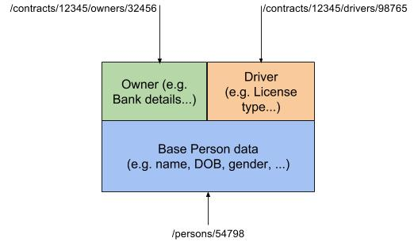

# The basedon Relation Type and an Expalantion of Contextual URIs

This article presents the rationale and processing around the `basedon` custom 
relation type. In so doing, however, it illustrates two important principles 
of URIs in a Hypermedia REST API:

* the client should never be aware of the structure of the URIs that the server
presents, relying, instead, on relation types to obtain the links that it is 
interested in, and following the associated URIs "blindly"
* the server, on the other hand, uses URIs to determine both the application 
entities and functionality that it exposes as RESTful resources, AND the 
application context in which that data is being referenced.

Consequently a reading of this article should result in a clearer understanding
of the use of URI structure from the server point view, and the absence of 
awareness of URI structure from the client point of view.

Two important implications of these principles are that, 
* as far as the client is concerned, there is **no resource hierarchy!** 
Resources are just "things" that it can navigate to and interact with via 
opaque URIs, with application meaning provided by their associated relnames in 
hypermedia link structures.
* server side contextual intepretation of URIs using these techniques can **eliminate the 
need to expose data modeling relation entities as resources**, which would otherwise "corrupt" the API with implementation detail of 
which the client should not be aware. 

## The Context Problem

The base issue to address is that, say, a person entity in a server system may 
have different data associated with it depending on the contextual role in 
which it is being referenced - whether it is as an owner of a contract or as a 
risk, or just a simple un-attached person.

The way to tackle this is to consider each "view" of a person to be a 
different resource. E.g:



(the term "view" is used in this article to denote different contextual 
decorations that build upon a base entity)

This is a "bounded context" approach to the problem and "perfectly" decouples 
the client and API from the implementation. From the client's point of view - 
each resource has its own URI and its own behavior. Even if the implementation 
stores all the data in one server-side entity it is still able to deduce from 
the URI which context (or "view") of that data the client is addressing.

But we are left with two issues upon resource modification:

* If the "base data" of the person is updated via a view of that person and 
the client holds representations of other views of that data, the client has 
no idea that it needs to update those other representations. 
    If one of those views is, itself, the base data then this is easily solved 
using the [Side-Effect Notification Pattern](Response-Content.md#side-effect-notification-pattern). 

    But this does not address the needs of other decorated views.

    For example, if the client holds representations of all three of the above 
views, then a PATCH of, say, name, through `/contracts/12345/drivers/98765` can 
easily return an `X-CSC-Modified` header with the `/persons/54798` URI (because the
driver resource "knows" that it is built on top of the person resource). 

    This will allow the client to update its representation of `/persons/54798`. 
But the the driver resource does not know that an owner resource built upon the
same base data even exists, and neither should it.

* If the "base" resource `/persons/54798` is directly updated via its own API, it
could issue an `X-CSC-Modified` header for each of the other views, but this has 
two problems:

  * It can be very difficult to calculate the set of possible views that the 
client might hold
  * If we are serious about decoupling, the base resource will never know 
(conceptually) what views are built upon it anyway

A three part solution to these problems is presented below.

### A note on opaque URIs

Before going any further, it must be stressed again that URI structure is 
completely irrelevant here - to the client the above three URIs might as well 
be:

* **Person:** `/persons/gobbldygook-and-fairies-dancing-in-the-moonlight`
* **Owner:** `/contracts/im-having-trouble-thinking-up-stupid-uri-strings`
* **Driver:** `/contracts/oh-apparently-im-not-having-trouble-at-all`

Which is to say that the server can structure URIs how ever best fits the needs
of the server. 

To the client they are theoretically opaque - and may actually 
be rendered opaque via encryption/hashing (such encryption/decryption should 
occur "in front of" the SOR so that the SOR itself would always see its 
meaningful URI).

As an example, GraphTalk AIA builds URIs that hint at the real person upon 
which a "view" resource is based. This is a perfectly acceptable approach; it 
is not necessary for other SORs to do this if it doesn't fit their needs, 
and it is not reflected in the example URIs used here.

Consequently, do not take the URI structures used in these examples as 
canonical - they are merely convenient for illustration.

## The Solution

The solution to the stated problem is in three parts

### 1) Introduction of the basedon link relation
When a resource is built upon another resource, the "decorated resource" will 
publish a "`basedon`" link relation referencing that base resource in its 
representations. 

So, for the above driver resource we would see:

```
{
    "_links": {
        "self": {
            "href": "/contracts/12345/drivers/98765"
        }
        "basedon": {
            "href": "/person/54798"
        }
        ....
    },
    ....
}
```

This is allowable because it is a legitimate inter-resource relation published 
in a standard manner. It allows the client to interrogate the base resource and
manipulate that without relying on the semantics of the implementation.

To cater for situations where a resource is built upon more than one base 
resource, or a nest of resources, the `basedon` relation can be either a 
single HAL link object or an array of HAL link objects.

When a resource conceptually constructs a representation of itself by GETting its `basedon` 
resources, it must include `basedon` links, returned by those nested GETs, to its 
own response representation. Thus the full set of `basedon` links for a 
particular resource will always be returned to the client, not just those upon 
which it is directly based, allowing the scheme to handle nests and 
multiple bases of any depth and complexity.

The `basedon` link relation is not an IETF standard relation and so should be 
"curied", but, for clarity, here it is not.

### 2) Enhanced use of the The X-CSC-Modified header

Recall that this header is issued when the server wishes to tell the client 
 
> you've just done something and as a result representations associated 
> with these other URIs which you might hold have also changed. 

This is the 
standard [Side-Effect Notification Pattern](Response-Content.md#side-effect-notification-pattern).

Continuing in this vein, then, when a modification to a base resource 
(`/person/54798`) is effected through a view (`/contracts/12345/drivers/98765`) 
the response will contain an `X-CSC-Modified` header containing the URI of the
base resource.

So the following request to PATCH the `person.name` property via the above driver
resource:

```
PATCH /contracts/12345/drivers/98765 HTTP/1.1
...
{
    "name": "James Dean"
}
```

will result in the following response (assuming the Content Location Pattern 
is being applied):

```
200 OK
Content-Location: /contracts/12345/drivers/98765 HTTP/1.1
X-CSC-Modified: /person/54798

{
    "_links": {
        "self": {
            "href": "/contracts/12345/drivers/98765"
        }
        "basedon": {
            "href": "/person/54798"
        }
        ...
    },

    "name": "James Dean"
    ...
}
```

Conversely, because a modification of the base resource through its own 
URI/representation has conceptually no concept of views built on top of that 
resource, such a modification will NOT result in an `X-CSC-Modified` header 
for itself nor for views of which the implementation might actually be aware. 
As far as the "Person service" is concerned, a PATCH to `/person/54798` is a 
simple modification, so its response is a simple modification response.

To cater for situations where a resource is built upon more than one base 
resource, or a hierarchy of resources, note that a modification made via a 
view is conceptually implemented by nested modifications to `basedon` resources. 
Each resource in such a modification chain is responsible for adding the URI 
of each resource upon which it is based and that it modified to the 
`X-CSC-Modified` header of its own response, and then appending the 
`X-CSC-Modified` URIs received from those base update responses to its own 
response.

For example, if we add another view to the basic hierarchy depicted above - 
say `specialOwner` built on top of `owner` (with a URI of 
`/contracts/12345/specialOwner/028741`) - then, attempting to update `person.name` 
through the `specialOwner` resource will conceptually involve:

* **client:** `PATCH /contracts/12345/specialOwner/028741`
* **specialOwner:** `PATCH /contracts/12345/owners/32456`
* **owner:** `PATCH  /person/54798`

The conceptual response chain will, therefore, involve (in reverse order):

* **from person:** no `X-CSC-Modified` header URIs
* **from owner:** an `X-CSC-Modified` header with one URI `/person/54798`
* **from specialOwner:** the `X-CSC-Modified` header URIs returned from the PATCH 
to owner (`/person/54798`), plus one for the owner view itself 
(`/contracts/12345/owners/32456`)
* **at the client:** the response has two URIs in the `X-CSC-Modified` header

### 3) Requirements for Client Processing

Tying this together requires specific client behavior to recognize the significance of
the `basedon` relation and its effect on clinet-side processing associated with the 
[Side-Effect Notification Pattern](Response-Content.md#side-effect-notification-pattern) .

In general the client must compare the `self` **and** `basedon` links from its set of live 
representations against any `X-CSC-Modified` URIs returned from a modifying 
request *and* against the URI of the target of that modifying request, 
or that of the created resource in the event of a `201 Created` response. Where 
matches are found, the associated representations must be refreshed. 

In other words:

* For each representation that the client holds, it should record both the 
`self` URI and and any `basedon` URIs in that representation
* When the client makes a modifying request, it should do the following with 
the successful response:
  * Create an empty set of `modified_URIs`
  * Add to that set the URIs of any `X-CSC-Modified` header accompanying the 
response
  * Add to that set the `self` URI from the modified or created resource 
(the resource to which the modification request was sent, or the resource 
created by the request in the event of a `201 Created` response)
  * Search through its set of representations for any where the `self` or 
`basedon` URIs are members of the `modified_URIs` set. For each affected 
representation, refresh its content by issuing a GET to the `self` URI of that 
representation.

Obviously, if the Content Location Pattern was used in the modification 
request, the client can avoid re-refreshing the representation it received 
in the modification response body.

This applies to ALL modifying requests - the client is not intrinsically aware 
of `basedon` relationships and so must assume that any representation it has 
could be built upon any other resource with which it may interact.

In practice, this should be a very fast check in a client, and this algorithm 
will NEVER result in unnecessary refresh requests - such requests will only be 
emitted if the response tells the client they are necessary via the matching 
of response URIs with `self` and `basedon` link URIs in the client's 
live representation set.
