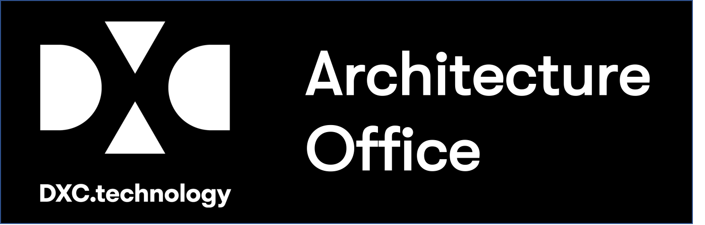

### DXC MOBILE APPLICATION STANDARDS

### Date - 6th Jun 2017

### Owner/s - 

## Overview  

This document outlines the Development and Operation best practices DXC require around the mobile applications we develop and operate for our clients. It will cover the main Mobile OS (iOS, Android, MS), and will consider all aspects of the Mobile device and data that is captured and handled.

## Sections
- [General Prescriptive Recommendations](./GeneralPrescription.md)
	- Native vs MEAP/MADP
	- Emulator/Simulator vs Devices
	- Secure Practices
	- DevOps
- [Android](./Android.md)
	- Development Environment
	- Language
	- Coding Standard
	- Testing
	- Performance
	- Security
	- UI
	- Learning Resources
- [iOS](./iOS.md)
 	- Development Environment
	- Language
	- Coding Standard
	- Testing
	- Performance
	- Security
	- UI
	- Learning Resources
- [Data Collection](./Data.md)
 	- GeoLocation
	- PID
- [Store Submission](Store.md)
- [Design](Design.md)
	- Layout
	- Navigation
	- Images
	- Screen Sizing 		
- [Mobile APIs](API.md)
- [Security](Security.md)
	- Regulated Data / App Purpose
	- Non Regulated 
- [Maintenance / Updates](Maintenance.md) 
